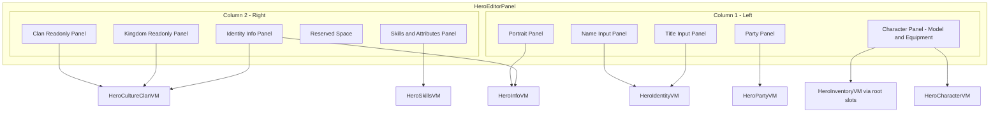

# Hero Editor UI Layout Restructure Plan

## Overview

Restructure the Hero Editor from a 3-column layout to a 2-column layout to:
1. Free up horizontal space for the hero list
2. Better organize panels into logical groups
3. Maintain modularity with each panel in its own prefab file

## Current vs New Layout Comparison

### Current Layout (3 columns)
```
+------------------+----------------------+------------------+
| HeroInfoColumn   | HeroCharacterColumn  | HeroSkillsColumn |
| - Name/Title     | - Portrait           | - Level          |
| - Clan/Kingdom   | - Character Model    | - Skills Grid    |
| - Basic Info     | - Equipment Slots    |                  |
| - Party          | - Loadout Selector   |                  |
+------------------+----------------------+------------------+
```

### New Layout (2 columns)
```
+------------------------+---------------------------+
| Column 1 - Left        | Column 2 - Right          |
+------------------------+---------------------------+
| HeroPortraitPanel      | ClanBannerPanel           |
| HeroNameInputPanel     | HeroClanNameReadonlyPanel |
| HeroTitleInputPanel    | HeroKingdomReadonlyPanel  |
| HeroCharacterPanel     | HeroIdentityInfoPanel     |
|  - Model               | HeroReservedSpacePanel    |
|  - Equipment Slots     | HeroSkillsAttributesPanel |
|  - Loadout Selector    |                           |
| HeroPartyPanel         |                           |
+------------------------+---------------------------+
```

## File Structure

```
Bannerlord.Commander/_Module/GUI/Prefabs/HeroEditor/
|-- HeroEditorPanel.xml           (MODIFY - main 2-column container)
|-- HeroEditorColumn1.xml         (NEW - left column container)
|-- HeroEditorColumn2.xml         (NEW - right column container)
|-- Panels/
|   |-- HeroPortraitPanel.xml         (NEW - Column 1, Panel 1)
|   |-- HeroNameInputPanel.xml        (NEW - Column 1, Panel 2)
|   |-- HeroTitleInputPanel.xml       (NEW - Column 1, Panel 3)
|   |-- HeroCharacterPanel.xml        (NEW - Column 1, Panel 4)
|   |-- HeroPartyPanel.xml            (NEW - Column 1, Panel 5)
|   |-- ClanBannerPanel.xml           (NEW - Column 2, Panel 1)
|   |-- HeroClanNameReadonlyPanel.xml (NEW - Column 2, Panel 2)
|   |-- HeroKingdomReadonlyPanel.xml  (NEW - Column 2, Panel 3)
|   |-- HeroIdentityInfoPanel.xml     (NEW - Column 2, Panel 4)
|   |-- HeroReservedSpacePanel.xml    (NEW - Column 2, Panel 5)
|   |-- HeroSkillsAttributesPanel.xml (NEW - Column 2, Panel 6)
|-- ClanSelectionPopup.xml        (KEEP - unchanged)
|-- OLD_HeroInfoColumn.xml        (RENAME for reference, delete later)
|-- OLD_HeroCharacterColumn.xml   (RENAME for reference, delete later)
|-- OLD_HeroSkillsColumn.xml      (RENAME for reference, delete later)
```

## Implementation Details

### 1. Hero List Width Increase

**File:** `CommanderHeroListPanel.xml`

**Change:**
- Current: `SuggestedWidth="1100"` on the main container
- Verify if width is fixed or flexible - may need to remove fixed width constraint
- Hero list should use `WidthSizePolicy="StretchToParent"` to take available space

The hero list columns that are cutoff need the list to extend further right into the space freed by reducing editor columns from 3 to 2.

### 2. Main Editor Panel Structure

**File:** `HeroEditorPanel.xml`

```xml
<Widget Id="HeroEditorRoot" DataSource="{..}"
  WidthSizePolicy="StretchToParent" HeightSizePolicy="StretchToParent">
  <Children>
    <!-- Border frame widgets -->
    
    <ListPanel Id="EditorColumnsLayout" 
      StackLayout.LayoutMethod="HorizontalLeftToRight">
      <Children>
        <!-- Left Column -->
        <HeroEditorColumn1 />
        
        <!-- Right Column -->
        <HeroEditorColumn2 />
      </Children>
    </ListPanel>
  </Children>
</Widget>
```

### 3. Column 1 - Left Column

**File:** `HeroEditorColumn1.xml`

**Structure:**
```xml
<Widget Id="Column1Root" WidthSizePolicy="Fixed" SuggestedWidth="320"
  HeightSizePolicy="StretchToParent">
  <Children>
    <ListPanel StackLayout.LayoutMethod="VerticalBottomToTop">
      <Children>
        <HeroPortraitPanel />       <!-- Panel 1 - Portrait at top -->
        <HeroNameInputPanel />      <!-- Panel 2 - Name input -->
        <HeroTitleInputPanel />     <!-- Panel 3 - Title input -->
        <HeroCharacterPanel />      <!-- Panel 4 - Character model + equipment -->
        <HeroPartyPanel />          <!-- Panel 5 - Party controls at bottom -->
      </Children>
    </ListPanel>
  </Children>
</Widget>
```

**DataSource Bindings:**
- Portrait panel: `DataSource="{HeroInfo}"`
- Name/Title panels: `DataSource="{HeroIdentity}"`
- Character panel: `DataSource="{HeroCharacter}"` for model, equipment slots from root
- Party panel: `DataSource="{HeroParty}"`

### 4. Column 2 - Right Column

**File:** `HeroEditorColumn2.xml`

**Structure:**
```xml
<Widget Id="Column2Root" WidthSizePolicy="StretchToParent"
  HeightSizePolicy="StretchToParent">
  <Children>
    <ListPanel StackLayout.LayoutMethod="VerticalBottomToTop">
      <Children>
        <ClanBannerPanel />             <!-- Panel 1 - Banner at top -->
        <HeroClanNameReadonlyPanel />   <!-- Panel 2 - Clan name -->
        <HeroKingdomReadonlyPanel />    <!-- Panel 3 - Kingdom name -->
        <HeroIdentityInfoPanel />       <!-- Panel 4 - Identity info -->
        <HeroReservedSpacePanel />      <!-- Panel 5 - Reserved space -->
        <HeroSkillsAttributesPanel />   <!-- Panel 6 - Skills at bottom -->
      </Children>
    </ListPanel>
  </Children>
</Widget>
```

**DataSource Bindings:**
- Clan Banner panel: `DataSource="{HeroCultureClan}"` (uses ClanBanner from HeroInfo)
- Clan Name panel: `DataSource="{HeroCultureClan}"`
- Kingdom panel: `DataSource="{HeroCultureClan}"`
- Identity panel: `DataSource="{HeroInfo}"` combined with `{HeroCultureClan}`
- Skills panel: `DataSource="{HeroSkills}"`

### 5. Individual Panel Specifications

#### HeroNameInputPanel.xml

**Purpose:** Editable hero name input field
**Height:** 30px fixed
**DataSource:** `{HeroIdentity}`

```xml
<!-- File: HeroEditor/Panels/HeroNameInputPanel.xml -->
<Widget Id="HeroNameInputPanelRoot" DataSource="{HeroIdentity}"
  WidthSizePolicy="StretchToParent"
  HeightSizePolicy="Fixed"
  SuggestedHeight="30"
  MarginBottom="4"
  Sprite="BlankWhiteSquare_9"
  Color="#1a1a1aFF">
  <Children>
    <!-- Border frame -->
    <Widget Id="NamePanelTopBorder" WidthSizePolicy="StretchToParent" HeightSizePolicy="Fixed"
      SuggestedHeight="2" VerticalAlignment="Top"
      Sprite="BlankWhiteSquare_9" Color="#8B7355FF" />
    <Widget Id="NamePanelBottomBorder" WidthSizePolicy="StretchToParent" HeightSizePolicy="Fixed"
      SuggestedHeight="2" VerticalAlignment="Bottom"
      Sprite="BlankWhiteSquare_9" Color="#8B7355FF" />
    <Widget Id="NamePanelLeftBorder" WidthSizePolicy="Fixed" HeightSizePolicy="StretchToParent"
      SuggestedWidth="2" HorizontalAlignment="Left"
      Sprite="BlankWhiteSquare_9" Color="#8B7355FF" />
    <Widget Id="NamePanelRightBorder" WidthSizePolicy="Fixed" HeightSizePolicy="StretchToParent"
      SuggestedWidth="2" HorizontalAlignment="Right"
      Sprite="BlankWhiteSquare_9" Color="#8B7355FF" />
    
    <!-- Label and Input -->
    <TextWidget Id="NameLabel" WidthSizePolicy="Fixed"
      HeightSizePolicy="StretchToParent"
      SuggestedWidth="50"
      MarginLeft="6"
      VerticalAlignment="Center"
      Brush="Clan.TabControl.Text"
      Brush.FontSize="13"
      Text="Name:" />
    <EditableTextWidget Id="NameInput" WidthSizePolicy="StretchToParent"
      HeightSizePolicy="StretchToParent"
      MarginLeft="58"
      MarginRight="6"
      MarginTop="4"
      MarginBottom="4"
      Brush="Clan.TabControl.Text"
      Brush.FontSize="13"
      Text="@HeroName" />
  </Children>
</Widget>
```

---

#### HeroTitleInputPanel.xml

**Purpose:** Editable hero title input field
**Height:** 30px fixed
**DataSource:** `{HeroIdentity}`

```xml
<!-- File: HeroEditor/Panels/HeroTitleInputPanel.xml -->
<Widget Id="HeroTitleInputPanelRoot" DataSource="{HeroIdentity}"
  WidthSizePolicy="StretchToParent"
  HeightSizePolicy="Fixed"
  SuggestedHeight="30"
  MarginBottom="8"
  Sprite="BlankWhiteSquare_9"
  Color="#1a1a1aFF">
  <Children>
    <!-- Border frame - same pattern as name panel -->
    <Widget Id="TitlePanelTopBorder" WidthSizePolicy="StretchToParent" HeightSizePolicy="Fixed"
      SuggestedHeight="2" VerticalAlignment="Top"
      Sprite="BlankWhiteSquare_9" Color="#8B7355FF" />
    <Widget Id="TitlePanelBottomBorder" WidthSizePolicy="StretchToParent" HeightSizePolicy="Fixed"
      SuggestedHeight="2" VerticalAlignment="Bottom"
      Sprite="BlankWhiteSquare_9" Color="#8B7355FF" />
    <Widget Id="TitlePanelLeftBorder" WidthSizePolicy="Fixed" HeightSizePolicy="StretchToParent"
      SuggestedWidth="2" HorizontalAlignment="Left"
      Sprite="BlankWhiteSquare_9" Color="#8B7355FF" />
    <Widget Id="TitlePanelRightBorder" WidthSizePolicy="Fixed" HeightSizePolicy="StretchToParent"
      SuggestedWidth="2" HorizontalAlignment="Right"
      Sprite="BlankWhiteSquare_9" Color="#8B7355FF" />
    
    <!-- Label and Input -->
    <TextWidget Id="TitleLabel" WidthSizePolicy="Fixed"
      HeightSizePolicy="StretchToParent"
      SuggestedWidth="50"
      MarginLeft="6"
      VerticalAlignment="Center"
      Brush="Clan.TabControl.Text"
      Brush.FontSize="13"
      Text="Title:" />
    <EditableTextWidget Id="TitleInput" WidthSizePolicy="StretchToParent"
      HeightSizePolicy="StretchToParent"
      MarginLeft="58"
      MarginRight="6"
      MarginTop="4"
      MarginBottom="4"
      Brush="Clan.TabControl.Text"
      Brush.FontSize="13"
      Text="@HeroTitle" />
  </Children>
</Widget>
```

---

#### HeroPortraitPanel.xml

**Purpose:** Hero portrait image display
**Height:** 180px fixed
**DataSource:** `{HeroInfo}`

```xml
<!-- File: HeroEditor/Panels/HeroPortraitPanel.xml -->
<Widget Id="HeroPortraitPanelRoot" DataSource="{HeroInfo}"
  WidthSizePolicy="Fixed"
  HeightSizePolicy="Fixed"
  SuggestedWidth="150"
  SuggestedHeight="180"
  HorizontalAlignment="Center"
  MarginBottom="8"
  Sprite="BlankWhiteSquare_9"
  Color="#1a1a1aFF">
  <Children>
    <!-- Border frame -->
    <Widget Id="PortraitTopBorder" WidthSizePolicy="StretchToParent" HeightSizePolicy="Fixed"
      SuggestedHeight="2" VerticalAlignment="Top"
      Sprite="BlankWhiteSquare_9" Color="#8B7355FF" />
    <Widget Id="PortraitBottomBorder" WidthSizePolicy="StretchToParent" HeightSizePolicy="Fixed"
      SuggestedHeight="2" VerticalAlignment="Bottom"
      Sprite="BlankWhiteSquare_9" Color="#8B7355FF" />
    <Widget Id="PortraitLeftBorder" WidthSizePolicy="Fixed" HeightSizePolicy="StretchToParent"
      SuggestedWidth="2" HorizontalAlignment="Left"
      Sprite="BlankWhiteSquare_9" Color="#8B7355FF" />
    <Widget Id="PortraitRightBorder" WidthSizePolicy="Fixed" HeightSizePolicy="StretchToParent"
      SuggestedWidth="2" HorizontalAlignment="Right"
      Sprite="BlankWhiteSquare_9" Color="#8B7355FF" />
    
    <!-- Portrait Image -->
    <ImageIdentifierWidget Id="PortraitImage" WidthSizePolicy="StretchToParent"
      HeightSizePolicy="StretchToParent"
      MarginTop="4"
      MarginBottom="4"
      MarginLeft="4"
      MarginRight="4"
      DataSource="{PortraitImage}"
      ImageTypeCode="@ImageTypeCode"
      AdditionalArgs="@AdditionalArgs"
      ImageId="@Id" />
  </Children>
</Widget>
```

---

#### HeroPartyPanel.xml

**Purpose:** Party status and control buttons
**Height:** 80px fixed
**DataSource:** `{HeroParty}`

```xml
<!-- File: HeroEditor/Panels/HeroPartyPanel.xml -->
<Widget Id="HeroPartyPanelRoot" DataSource="{HeroParty}"
  WidthSizePolicy="StretchToParent"
  HeightSizePolicy="Fixed"
  SuggestedHeight="80"
  MarginBottom="8"
  Sprite="BlankWhiteSquare_9"
  Color="#1a1a1aFF">
  <Children>
    <!-- Border frame -->
    <Widget Id="PartyTopBorder" WidthSizePolicy="StretchToParent" HeightSizePolicy="Fixed"
      SuggestedHeight="2" VerticalAlignment="Top"
      Sprite="BlankWhiteSquare_9" Color="#8B7355FF" />
    <Widget Id="PartyBottomBorder" WidthSizePolicy="StretchToParent" HeightSizePolicy="Fixed"
      SuggestedHeight="2" VerticalAlignment="Bottom"
      Sprite="BlankWhiteSquare_9" Color="#8B7355FF" />
    <Widget Id="PartyLeftBorder" WidthSizePolicy="Fixed" HeightSizePolicy="StretchToParent"
      SuggestedWidth="2" HorizontalAlignment="Left"
      Sprite="BlankWhiteSquare_9" Color="#8B7355FF" />
    <Widget Id="PartyRightBorder" WidthSizePolicy="Fixed" HeightSizePolicy="StretchToParent"
      SuggestedWidth="2" HorizontalAlignment="Right"
      Sprite="BlankWhiteSquare_9" Color="#8B7355FF" />
    
    <ListPanel Id="PartyContent" WidthSizePolicy="StretchToParent"
      HeightSizePolicy="StretchToParent"
      MarginTop="4"
      MarginBottom="4"
      MarginLeft="4"
      MarginRight="4"
      StackLayout.LayoutMethod="VerticalBottomToTop">
      <Children>
        <!-- Party Status Text -->
        <TextWidget Id="PartyStatusText" WidthSizePolicy="StretchToParent"
          HeightSizePolicy="Fixed"
          SuggestedHeight="18"
          MarginBottom="4"
          Brush="Clan.TabControl.Text"
          Brush.FontSize="11"
          Brush.TextHorizontalAlignment="Center"
          Text="@PartyStatusText" />
        
        <!-- Party Buttons Row -->
        <ListPanel Id="PartyButtonsRow" WidthSizePolicy="StretchToParent"
          HeightSizePolicy="Fixed"
          SuggestedHeight="24"
          MarginBottom="2"
          StackLayout.LayoutMethod="HorizontalLeftToRight">
          <Children>
            <ButtonWidget Id="DisbandPartyButton" DoNotPassEventsToChildren="true"
              WidthSizePolicy="StretchToParent"
              HeightSizePolicy="StretchToParent"
              MarginRight="2"
              Command.Click="ExecuteDisbandParty"
              IsEnabled="@CanDisbandParty">
              <Children>
                <Widget Id="DisbandBg" WidthSizePolicy="StretchToParent"
                  HeightSizePolicy="StretchToParent"
                  Sprite="BlankWhiteSquare_9"
                  Color="#453920FF" />
                <TextWidget Id="DisbandText" WidthSizePolicy="StretchToParent"
                  HeightSizePolicy="StretchToParent"
                  HorizontalAlignment="Center"
                  VerticalAlignment="Center"
                  Brush="Clan.TabControl.Text"
                  Brush.FontSize="11"
                  Text="Disband" />
              </Children>
            </ButtonWidget>
            <ButtonWidget Id="TogglePartyButton" DoNotPassEventsToChildren="true"
              WidthSizePolicy="StretchToParent"
              HeightSizePolicy="StretchToParent"
              MarginLeft="2"
              Command.Click="ExecuteToggleParty">
              <Children>
                <Widget Id="ToggleBg" WidthSizePolicy="StretchToParent"
                  HeightSizePolicy="StretchToParent"
                  Sprite="BlankWhiteSquare_9"
                  Color="#453920FF" />
                <TextWidget Id="ToggleText" WidthSizePolicy="StretchToParent"
                  HeightSizePolicy="StretchToParent"
                  HorizontalAlignment="Center"
                  VerticalAlignment="Center"
                  Brush="Clan.TabControl.Text"
                  Brush.FontSize="10"
                  Text="@TogglePartyButtonText" />
              </Children>
            </ButtonWidget>
          </Children>
        </ListPanel>
        
        <!-- Edit Party Button -->
        <ButtonWidget Id="EditPartyButton" DoNotPassEventsToChildren="true"
          WidthSizePolicy="StretchToParent"
          HeightSizePolicy="Fixed"
          SuggestedHeight="24"
          Command.Click="ExecuteEditParty"
          IsEnabled="@CanEditParty">
          <Children>
            <Widget Id="EditPartyBg" WidthSizePolicy="StretchToParent"
              HeightSizePolicy="StretchToParent"
              Sprite="BlankWhiteSquare_9"
              Color="#453920FF" />
            <TextWidget Id="EditPartyText" WidthSizePolicy="StretchToParent"
              HeightSizePolicy="StretchToParent"
              HorizontalAlignment="Center"
              VerticalAlignment="Center"
              Brush="Clan.TabControl.Text"
              Brush.FontSize="11"
              Text="Edit Party" />
          </Children>
        </ButtonWidget>
      </Children>
    </ListPanel>
  </Children>
</Widget>
```

---

#### HeroCharacterPanel.xml

**Purpose:** Character model display with equipment slots and loadout selector
**Height:** Stretch to fill remaining space
**DataSource:** Root for equipment slots via flat binding, `{HeroCharacter}` for model, `{HeroInventory}` for loadout

This is the most complex panel. It contains:
1. Equipment slots (7 armor + 5 weapon/banner)
2. Character 3D model (CharacterTableauWidget)
3. Loadout selector

```xml
<!-- File: HeroEditor/Panels/HeroCharacterPanel.xml -->
<Widget Id="HeroCharacterPanelRoot"
  WidthSizePolicy="StretchToParent"
  HeightSizePolicy="StretchToParent"
  Sprite="BlankWhiteSquare_9"
  Color="#1a1a1aFF">
  <Children>
    <!-- Border frame -->
    <Widget Id="CharPanelTopBorder" WidthSizePolicy="StretchToParent" HeightSizePolicy="Fixed"
      SuggestedHeight="2" VerticalAlignment="Top"
      Sprite="BlankWhiteSquare_9" Color="#8B7355FF" />
    <Widget Id="CharPanelBottomBorder" WidthSizePolicy="StretchToParent" HeightSizePolicy="Fixed"
      SuggestedHeight="2" VerticalAlignment="Bottom"
      Sprite="BlankWhiteSquare_9" Color="#8B7355FF" />
    <Widget Id="CharPanelLeftBorder" WidthSizePolicy="Fixed" HeightSizePolicy="StretchToParent"
      SuggestedWidth="2" HorizontalAlignment="Left"
      Sprite="BlankWhiteSquare_9" Color="#8B7355FF" />
    <Widget Id="CharPanelRightBorder" WidthSizePolicy="Fixed" HeightSizePolicy="StretchToParent"
      SuggestedWidth="2" HorizontalAlignment="Right"
      Sprite="BlankWhiteSquare_9" Color="#8B7355FF" />
    
    <ListPanel Id="CharacterPanelLayout" WidthSizePolicy="StretchToParent"
      HeightSizePolicy="StretchToParent"
      StackLayout.LayoutMethod="VerticalBottomToTop">
      <Children>
        
        <!-- EQUIPMENT AND MODEL SECTION -->
        <ListPanel Id="ModelEquipmentLayout" WidthSizePolicy="StretchToParent"
          HeightSizePolicy="StretchToParent"
          StackLayout.LayoutMethod="HorizontalLeftToRight">
          <Children>
            
            <!-- LEFT: ARMOR SLOTS (7 slots vertical) -->
            <ListPanel Id="ArmorSlotsColumn" WidthSizePolicy="Fixed"
              HeightSizePolicy="StretchToParent"
              SuggestedWidth="55"
              MarginLeft="4"
              MarginTop="4"
              MarginBottom="4"
              StackLayout.LayoutMethod="VerticalBottomToTop">
              <Children>
                <!-- Each slot uses FLAT binding from root HeroEditorVM -->
                
                <!-- Head Slot -->
                <Widget Id="HeadSlotContainer" DataSource="{HeadSlot}"
                  WidthSizePolicy="Fixed" HeightSizePolicy="Fixed"
                  SuggestedWidth="50" SuggestedHeight="50"
                  MarginBottom="2">
                  <Children>
                    <BrushWidget Id="HeadBg" WidthSizePolicy="StretchToParent"
                      HeightSizePolicy="StretchToParent"
                      Brush="InventoryHelmetSlot" />
                    <CommanderEquipmentSlotWidget Id="HeadSlotWidget"
                      WidthSizePolicy="StretchToParent"
                      HeightSizePolicy="StretchToParent"
                      DoNotPassEventsToChildren="true"
                      Command.Click="ExecuteSelectSlot"
                      Background="..\HeadBg"
                      ImageIdentifier="HeadImage"
                      IsSelected="@IsSelected">
                      <Children>
                        <Widget Id="HeadPlaceholder" WidthSizePolicy="StretchToParent"
                          HeightSizePolicy="StretchToParent"
                          MarginLeft="2" MarginRight="2" MarginTop="2" MarginBottom="2"
                          Sprite="Inventory\portrait_cart" />
                        <ImageIdentifierWidget Id="HeadImage"
                          DataSource="{ImageIdentifier}"
                          WidthSizePolicy="StretchToParent"
                          HeightSizePolicy="StretchToParent"
                          MarginLeft="2" MarginRight="2" MarginTop="2" MarginBottom="2"
                          ImageId="@Id"
                          AdditionalArgs="@AdditionalArgs"
                          TextureProviderName="@TextureProviderName" />
                      </Children>
                    </CommanderEquipmentSlotWidget>
                  </Children>
                </Widget>
                
                <!-- Cape Slot - same pattern -->
                <!-- Body Slot - same pattern -->
                <!-- Gloves Slot - same pattern -->
                <!-- Leg Slot - same pattern -->
                <!-- Horse Slot - same pattern -->
                <!-- Horse Harness Slot - same pattern -->
                
              </Children>
            </ListPanel>
            
            <!-- CENTER: CHARACTER MODEL -->
            <Widget Id="CharacterModelWidget" DataSource="{HeroCharacter}"
              WidthSizePolicy="StretchToParent"
              HeightSizePolicy="StretchToParent">
              <Children>
                <CharacterTableauWidget Id="CharacterTableau"
                  WidthSizePolicy="StretchToParent"
                  HeightSizePolicy="StretchToParent"
                  BodyProperties="@BodyProperties"
                  StanceIndex="@StanceIndex"
                  IsFemale="@IsFemale"
                  EquipmentCode="@EquipmentCode"
                  BannerCodeText="@BannerCodeText"
                  CharStringId="@CharStringId"
                  MountCreationKey="@MountCreationKey"
                  ArmorColor1="@ArmorColor1"
                  ArmorColor2="@ArmorColor2"
                  Race="@Race"
                  IsEquipmentAnimActive="true"
                  RightHandWieldedEquipmentIndex="0"
                  LeftHandWieldedEquipmentIndex="1" />
              </Children>
            </Widget>
            
            <!-- RIGHT: WEAPON SLOTS (5 slots vertical) -->
            <ListPanel Id="WeaponSlotsColumn" WidthSizePolicy="Fixed"
              HeightSizePolicy="StretchToParent"
              SuggestedWidth="45"
              MarginRight="4"
              MarginTop="4"
              MarginBottom="4"
              StackLayout.LayoutMethod="VerticalBottomToTop">
              <Children>
                <!-- Weapon0 through Weapon3 slots - same pattern as armor -->
                <!-- Banner Slot - same pattern -->
              </Children>
            </ListPanel>
            
          </Children>
        </ListPanel>
        
        <!-- LOADOUT SELECTOR -->
        <Widget Id="LoadoutContainer" DataSource="{HeroInventory}"
          WidthSizePolicy="StretchToParent"
          HeightSizePolicy="Fixed"
          SuggestedHeight="32">
          <Children>
            <ListPanel Id="LoadoutPanel" WidthSizePolicy="CoverChildren"
              HeightSizePolicy="StretchToParent"
              HorizontalAlignment="Center"
              StackLayout.LayoutMethod="HorizontalLeftToRight">
              <Children>
                <TextWidget Id="LoadoutLabel" WidthSizePolicy="CoverChildren"
                  HeightSizePolicy="StretchToParent"
                  MarginRight="8"
                  VerticalAlignment="Center"
                  Brush="TownManagement.Description.Title.Text"
                  Brush.FontSize="12"
                  Text="Loadout:" />
                <ButtonWidget Id="LoadoutToggleBtn" DoNotPassEventsToChildren="true"
                  WidthSizePolicy="CoverChildren"
                  HeightSizePolicy="Fixed"
                  SuggestedHeight="22"
                  VerticalAlignment="Center"
                  Command.Click="ExecuteToggleLoadout">
                  <Children>
                    <Widget Id="LoadoutBtnBg" WidthSizePolicy="StretchToParent"
                      HeightSizePolicy="StretchToParent"
                      Sprite="BlankWhiteSquare_9"
                      Color="#453920FF" />
                    <TextWidget Id="LoadoutName" WidthSizePolicy="CoverChildren"
                      HeightSizePolicy="StretchToParent"
                      MarginLeft="10"
                      MarginRight="10"
                      VerticalAlignment="Center"
                      Brush="Clan.TabControl.Text"
                      Brush.FontSize="11"
                      Text="@LoadoutName" />
                  </Children>
                </ButtonWidget>
              </Children>
            </ListPanel>
          </Children>
        </Widget>
        
      </Children>
    </ListPanel>
  </Children>
</Widget>
```

**Note:** The equipment slots shown above are abbreviated. Each of the 12 slots (Head, Cape, Body, Gloves, Leg, Horse, HorseHarness, Weapon0, Weapon1, Weapon2, Weapon3, Banner) follows the same pattern with appropriate Brush names.

---

#### ClanBannerPanel.xml

**Purpose:** Display clan banner only (large banner display)
**Height:** 120px fixed
**DataSource:** `{HeroCultureClan}` (accessing ClanBanner via HeroInfo)

```xml
<!-- File: HeroEditor/Panels/ClanBannerPanel.xml -->
<Widget Id="ClanBannerPanelRoot" DataSource="{HeroCultureClan}"
  WidthSizePolicy="StretchToParent"
  HeightSizePolicy="Fixed"
  SuggestedHeight="120"
  MarginBottom="4"
  Sprite="BlankWhiteSquare_9"
  Color="#1a1a1aFF">
  <Children>
    <!-- Border frame -->
    <Widget Id="BannerPanelTopBorder" WidthSizePolicy="StretchToParent" HeightSizePolicy="Fixed"
      SuggestedHeight="2" VerticalAlignment="Top"
      Sprite="BlankWhiteSquare_9" Color="#8B7355FF" />
    <Widget Id="BannerPanelBottomBorder" WidthSizePolicy="StretchToParent" HeightSizePolicy="Fixed"
      SuggestedHeight="2" VerticalAlignment="Bottom"
      Sprite="BlankWhiteSquare_9" Color="#8B7355FF" />
    <Widget Id="BannerPanelLeftBorder" WidthSizePolicy="Fixed" HeightSizePolicy="StretchToParent"
      SuggestedWidth="2" HorizontalAlignment="Left"
      Sprite="BlankWhiteSquare_9" Color="#8B7355FF" />
    <Widget Id="BannerPanelRightBorder" WidthSizePolicy="Fixed" HeightSizePolicy="StretchToParent"
      SuggestedWidth="2" HorizontalAlignment="Right"
      Sprite="BlankWhiteSquare_9" Color="#8B7355FF" />
    
    <!-- Centered Clan Banner -->
    <Widget Id="ClanBannerContainer" WidthSizePolicy="Fixed"
      HeightSizePolicy="Fixed"
      SuggestedWidth="100"
      SuggestedHeight="110"
      HorizontalAlignment="Center"
      VerticalAlignment="Center">
      <Children>
        <MaskedTextureWidget Id="ClanBannerImage" DataSource="{HeroInfo\ClanBanner}"
          WidthSizePolicy="StretchToParent"
          HeightSizePolicy="StretchToParent"
          Brush="Clan.TornBanner"
          AdditionalArgs="@AdditionalArgs"
          ImageId="@Id"
          TextureProviderName="@TextureProviderName" />
      </Children>
    </Widget>
  </Children>
</Widget>
```

---

#### HeroClanNameReadonlyPanel.xml

**Purpose:** Display clan name only (readonly text)
**Height:** 35px fixed
**DataSource:** `{HeroCultureClan}`

```xml
<!-- File: HeroEditor/Panels/HeroClanNameReadonlyPanel.xml -->
<Widget Id="HeroClanNameReadonlyPanelRoot" DataSource="{HeroCultureClan}"
  WidthSizePolicy="StretchToParent"
  HeightSizePolicy="Fixed"
  SuggestedHeight="35"
  MarginBottom="4"
  Sprite="BlankWhiteSquare_9"
  Color="#1a1a1aFF">
  <Children>
    <!-- Border frame -->
    <Widget Id="ClanNameTopBorder" WidthSizePolicy="StretchToParent" HeightSizePolicy="Fixed"
      SuggestedHeight="2" VerticalAlignment="Top"
      Sprite="BlankWhiteSquare_9" Color="#8B7355FF" />
    <Widget Id="ClanNameBottomBorder" WidthSizePolicy="StretchToParent" HeightSizePolicy="Fixed"
      SuggestedHeight="2" VerticalAlignment="Bottom"
      Sprite="BlankWhiteSquare_9" Color="#8B7355FF" />
    <Widget Id="ClanNameLeftBorder" WidthSizePolicy="Fixed" HeightSizePolicy="StretchToParent"
      SuggestedWidth="2" HorizontalAlignment="Left"
      Sprite="BlankWhiteSquare_9" Color="#8B7355FF" />
    <Widget Id="ClanNameRightBorder" WidthSizePolicy="Fixed" HeightSizePolicy="StretchToParent"
      SuggestedWidth="2" HorizontalAlignment="Right"
      Sprite="BlankWhiteSquare_9" Color="#8B7355FF" />
    
    <ListPanel Id="ClanNameContent" WidthSizePolicy="StretchToParent"
      HeightSizePolicy="StretchToParent"
      MarginTop="4"
      MarginBottom="4"
      MarginLeft="6"
      MarginRight="6"
      StackLayout.LayoutMethod="HorizontalLeftToRight">
      <Children>
        <TextWidget Id="ClanLabel" WidthSizePolicy="CoverChildren"
          HeightSizePolicy="StretchToParent"
          VerticalAlignment="Center"
          Brush="Clan.TabControl.Text"
          Brush.FontSize="11"
          Text="Clan: " />
        <TextWidget Id="ClanNameText" WidthSizePolicy="StretchToParent"
          HeightSizePolicy="StretchToParent"
          VerticalAlignment="Center"
          Brush="Clan.TabControl.Text"
          Brush.FontSize="13"
          Text="@ClanName" />
      </Children>
    </ListPanel>
  </Children>
</Widget>
```

---

#### HeroKingdomReadonlyPanel.xml

**Purpose:** Display kingdom name (readonly)
**Height:** 30px fixed
**DataSource:** `{HeroCultureClan}`

```xml
<!-- File: HeroEditor/Panels/HeroKingdomReadonlyPanel.xml -->
<Widget Id="HeroKingdomReadonlyPanelRoot" DataSource="{HeroCultureClan}"
  WidthSizePolicy="StretchToParent"
  HeightSizePolicy="Fixed"
  SuggestedHeight="30"
  MarginBottom="4"
  Sprite="BlankWhiteSquare_9"
  Color="#1a1a1aFF">
  <Children>
    <!-- Border frame -->
    <Widget Id="KingdomReadTopBorder" WidthSizePolicy="StretchToParent" HeightSizePolicy="Fixed"
      SuggestedHeight="2" VerticalAlignment="Top"
      Sprite="BlankWhiteSquare_9" Color="#8B7355FF" />
    <Widget Id="KingdomReadBottomBorder" WidthSizePolicy="StretchToParent" HeightSizePolicy="Fixed"
      SuggestedHeight="2" VerticalAlignment="Bottom"
      Sprite="BlankWhiteSquare_9" Color="#8B7355FF" />
    <Widget Id="KingdomReadLeftBorder" WidthSizePolicy="Fixed" HeightSizePolicy="StretchToParent"
      SuggestedWidth="2" HorizontalAlignment="Left"
      Sprite="BlankWhiteSquare_9" Color="#8B7355FF" />
    <Widget Id="KingdomReadRightBorder" WidthSizePolicy="Fixed" HeightSizePolicy="StretchToParent"
      SuggestedWidth="2" HorizontalAlignment="Right"
      Sprite="BlankWhiteSquare_9" Color="#8B7355FF" />
    
    <ListPanel Id="KingdomContent" WidthSizePolicy="StretchToParent"
      HeightSizePolicy="StretchToParent"
      MarginTop="4"
      MarginBottom="4"
      MarginLeft="6"
      MarginRight="6"
      StackLayout.LayoutMethod="HorizontalLeftToRight">
      <Children>
        <TextWidget Id="KingdomLabel" WidthSizePolicy="CoverChildren"
          HeightSizePolicy="StretchToParent"
          VerticalAlignment="Center"
          Brush="Clan.TabControl.Text"
          Brush.FontSize="11"
          Text="Kingdom: " />
        <TextWidget Id="KingdomNameText" WidthSizePolicy="StretchToParent"
          HeightSizePolicy="StretchToParent"
          VerticalAlignment="Center"
          Brush="Clan.TabControl.Text"
          Brush.FontSize="13"
          Text="@KingdomName" />
      </Children>
    </ListPanel>
  </Children>
</Widget>
```

---

#### HeroIdentityInfoPanel.xml

**Purpose:** Display hero identity info (Gender, Age, DOB, Death date, Culture)
**Height:** 110px fixed
**DataSource:** `{HeroInfo}` for most, `{HeroCultureClan}` for culture

```xml
<!-- File: HeroEditor/Panels/HeroIdentityInfoPanel.xml -->
<Widget Id="HeroIdentityInfoPanelRoot" DataSource="{HeroInfo}"
  WidthSizePolicy="StretchToParent"
  HeightSizePolicy="Fixed"
  SuggestedHeight="110"
  MarginBottom="4"
  Sprite="BlankWhiteSquare_9"
  Color="#1a1a1aFF">
  <Children>
    <!-- Border frame -->
    <Widget Id="IdentityInfoTopBorder" WidthSizePolicy="StretchToParent" HeightSizePolicy="Fixed"
      SuggestedHeight="2" VerticalAlignment="Top"
      Sprite="BlankWhiteSquare_9" Color="#8B7355FF" />
    <Widget Id="IdentityInfoBottomBorder" WidthSizePolicy="StretchToParent" HeightSizePolicy="Fixed"
      SuggestedHeight="2" VerticalAlignment="Bottom"
      Sprite="BlankWhiteSquare_9" Color="#8B7355FF" />
    <Widget Id="IdentityInfoLeftBorder" WidthSizePolicy="Fixed" HeightSizePolicy="StretchToParent"
      SuggestedWidth="2" HorizontalAlignment="Left"
      Sprite="BlankWhiteSquare_9" Color="#8B7355FF" />
    <Widget Id="IdentityInfoRightBorder" WidthSizePolicy="Fixed" HeightSizePolicy="StretchToParent"
      SuggestedWidth="2" HorizontalAlignment="Right"
      Sprite="BlankWhiteSquare_9" Color="#8B7355FF" />
    
    <ListPanel Id="IdentityContent" WidthSizePolicy="StretchToParent"
      HeightSizePolicy="StretchToParent"
      MarginTop="4"
      MarginBottom="4"
      MarginLeft="6"
      MarginRight="6"
      StackLayout.LayoutMethod="VerticalBottomToTop">
      <Children>
        <!-- Gender and Age Row -->
        <ListPanel Id="GenderAgeRow" WidthSizePolicy="StretchToParent"
          HeightSizePolicy="Fixed"
          SuggestedHeight="18"
          MarginBottom="2"
          StackLayout.LayoutMethod="HorizontalLeftToRight">
          <Children>
            <TextWidget Id="GenderLabel" WidthSizePolicy="CoverChildren"
              HeightSizePolicy="StretchToParent"
              Brush="Clan.TabControl.Text"
              Brush.FontSize="11"
              Text="Gender: " />
            <TextWidget Id="GenderValue" WidthSizePolicy="CoverChildren"
              HeightSizePolicy="StretchToParent"
              Brush="Clan.TabControl.Text"
              Brush.FontSize="11"
              Text="@Gender" />
            <TextWidget Id="AgeLabel" WidthSizePolicy="CoverChildren"
              HeightSizePolicy="StretchToParent"
              MarginLeft="20"
              Brush="Clan.TabControl.Text"
              Brush.FontSize="11"
              Text="Age: " />
            <TextWidget Id="AgeValue" WidthSizePolicy="CoverChildren"
              HeightSizePolicy="StretchToParent"
              Brush="Clan.TabControl.Text"
              Brush.FontSize="11"
              Text="@AgeText" />
          </Children>
        </ListPanel>
        
        <!-- Birth Date Row -->
        <ListPanel Id="BirthRow" WidthSizePolicy="StretchToParent"
          HeightSizePolicy="Fixed"
          SuggestedHeight="18"
          MarginBottom="2"
          StackLayout.LayoutMethod="HorizontalLeftToRight">
          <Children>
            <TextWidget Id="BirthLabel" WidthSizePolicy="CoverChildren"
              HeightSizePolicy="StretchToParent"
              Brush="Clan.TabControl.Text"
              Brush.FontSize="11"
              Text="Born: " />
            <TextWidget Id="BirthValue" WidthSizePolicy="StretchToParent"
              HeightSizePolicy="StretchToParent"
              Brush="Clan.TabControl.Text"
              Brush.FontSize="11"
              Text="@BirthDateText" />
          </Children>
        </ListPanel>
        
        <!-- Death Date Row -->
        <ListPanel Id="DeathRow" WidthSizePolicy="StretchToParent"
          HeightSizePolicy="Fixed"
          SuggestedHeight="18"
          MarginBottom="2"
          StackLayout.LayoutMethod="HorizontalLeftToRight">
          <Children>
            <TextWidget Id="DeathLabel" WidthSizePolicy="CoverChildren"
              HeightSizePolicy="StretchToParent"
              Brush="Clan.TabControl.Text"
              Brush.FontSize="11"
              Text="Death: " />
            <TextWidget Id="DeathValue" WidthSizePolicy="StretchToParent"
              HeightSizePolicy="StretchToParent"
              Brush="Clan.TabControl.Text"
              Brush.FontSize="11"
              Text="@DeathDateText" />
          </Children>
        </ListPanel>
        
        <!-- Culture Row - uses HeroCultureClan datasource -->
        <ListPanel Id="CultureRow" DataSource="{HeroCultureClan}"
          WidthSizePolicy="StretchToParent"
          HeightSizePolicy="Fixed"
          SuggestedHeight="18"
          StackLayout.LayoutMethod="HorizontalLeftToRight">
          <Children>
            <TextWidget Id="CultureLabel" WidthSizePolicy="CoverChildren"
              HeightSizePolicy="StretchToParent"
              Brush="Clan.TabControl.Text"
              Brush.FontSize="11"
              Text="Culture: " />
            <TextWidget Id="CultureValue" WidthSizePolicy="StretchToParent"
              HeightSizePolicy="StretchToParent"
              Brush="Clan.TabControl.Text"
              Brush.FontSize="11"
              Text="@CultureName" />
          </Children>
        </ListPanel>
      </Children>
    </ListPanel>
  </Children>
</Widget>
```

---

#### HeroReservedSpacePanel.xml

**Purpose:** Placeholder panel for future functionality
**Height:** Flexible (StretchToParent or Fixed)
**DataSource:** None

```xml
<!-- File: HeroEditor/Panels/HeroReservedSpacePanel.xml -->
<Widget Id="HeroReservedSpacePanelRoot"
  WidthSizePolicy="StretchToParent"
  HeightSizePolicy="Fixed"
  SuggestedHeight="60"
  MarginBottom="4"
  Sprite="BlankWhiteSquare_9"
  Color="#1a1a1aFF">
  <Children>
    <!-- Border frame -->
    <Widget Id="ReservedTopBorder" WidthSizePolicy="StretchToParent" HeightSizePolicy="Fixed"
      SuggestedHeight="2" VerticalAlignment="Top"
      Sprite="BlankWhiteSquare_9" Color="#8B7355FF" />
    <Widget Id="ReservedBottomBorder" WidthSizePolicy="StretchToParent" HeightSizePolicy="Fixed"
      SuggestedHeight="2" VerticalAlignment="Bottom"
      Sprite="BlankWhiteSquare_9" Color="#8B7355FF" />
    <Widget Id="ReservedLeftBorder" WidthSizePolicy="Fixed" HeightSizePolicy="StretchToParent"
      SuggestedWidth="2" HorizontalAlignment="Left"
      Sprite="BlankWhiteSquare_9" Color="#8B7355FF" />
    <Widget Id="ReservedRightBorder" WidthSizePolicy="Fixed" HeightSizePolicy="StretchToParent"
      SuggestedWidth="2" HorizontalAlignment="Right"
      Sprite="BlankWhiteSquare_9" Color="#8B7355FF" />
    
    <!-- Placeholder Text -->
    <TextWidget Id="ReservedText" WidthSizePolicy="StretchToParent"
      HeightSizePolicy="StretchToParent"
      HorizontalAlignment="Center"
      VerticalAlignment="Center"
      Brush="Clan.TabControl.Text"
      Brush.FontSize="10"
      Brush.TextHorizontalAlignment="Center"
      Text="Reserved Space" />
  </Children>
</Widget>
```

---

#### HeroSkillsAttributesPanel.xml

**Purpose:** Display level, attributes, and all 18 skills
**Height:** Stretch to fill remaining space
**DataSource:** `{HeroSkills}`

```xml
<!-- File: HeroEditor/Panels/HeroSkillsAttributesPanel.xml -->
<Widget Id="HeroSkillsAttributesPanelRoot" DataSource="{HeroSkills}"
  WidthSizePolicy="StretchToParent"
  HeightSizePolicy="StretchToParent"
  Sprite="BlankWhiteSquare_9"
  Color="#1a1a1aFF">
  <Children>
    <!-- Border frame -->
    <Widget Id="SkillsAttrTopBorder" WidthSizePolicy="StretchToParent" HeightSizePolicy="Fixed"
      SuggestedHeight="2" VerticalAlignment="Top"
      Sprite="BlankWhiteSquare_9" Color="#8B7355FF" />
    <Widget Id="SkillsAttrBottomBorder" WidthSizePolicy="StretchToParent" HeightSizePolicy="Fixed"
      SuggestedHeight="2" VerticalAlignment="Bottom"
      Sprite="BlankWhiteSquare_9" Color="#8B7355FF" />
    <Widget Id="SkillsAttrLeftBorder" WidthSizePolicy="Fixed" HeightSizePolicy="StretchToParent"
      SuggestedWidth="2" HorizontalAlignment="Left"
      Sprite="BlankWhiteSquare_9" Color="#8B7355FF" />
    <Widget Id="SkillsAttrRightBorder" WidthSizePolicy="Fixed" HeightSizePolicy="StretchToParent"
      SuggestedWidth="2" HorizontalAlignment="Right"
      Sprite="BlankWhiteSquare_9" Color="#8B7355FF" />
    
    <ListPanel Id="SkillsContent" WidthSizePolicy="StretchToParent"
      HeightSizePolicy="StretchToParent"
      MarginTop="6"
      MarginBottom="6"
      MarginLeft="6"
      MarginRight="6"
      StackLayout.LayoutMethod="VerticalBottomToTop">
      <Children>
        
        <!-- Level Header -->
        <ListPanel Id="LevelHeader" WidthSizePolicy="StretchToParent"
          HeightSizePolicy="Fixed"
          SuggestedHeight="22"
          MarginBottom="6"
          StackLayout.LayoutMethod="HorizontalLeftToRight">
          <Children>
            <TextWidget Id="LevelLabel" WidthSizePolicy="CoverChildren"
              HeightSizePolicy="StretchToParent"
              VerticalAlignment="Center"
              Brush="TownManagement.Description.Title.Text"
              Brush.FontSize="14"
              Text="Level " />
            <TextWidget Id="LevelValue" WidthSizePolicy="CoverChildren"
              HeightSizePolicy="StretchToParent"
              VerticalAlignment="Center"
              Brush="TownManagement.Description.Value.Text"
              Brush.FontSize="14"
              IntText="@Level" />
          </Children>
        </ListPanel>
        
        <!-- Attribute Groups (6 attributes, each with 3 skills) -->
        <ListPanel Id="AttributeGroupsList" WidthSizePolicy="StretchToParent"
          HeightSizePolicy="StretchToParent"
          DataSource="{AttributeGroups}"
          StackLayout.LayoutMethod="VerticalBottomToTop">
          <ItemTemplate>
            <!-- Single Attribute Group -->
            <Widget Id="AttributeGroupContainer" WidthSizePolicy="StretchToParent"
              HeightSizePolicy="Fixed"
              SuggestedHeight="65"
              MarginBottom="3">
              <Children>
                <ListPanel Id="AttributeLayout" WidthSizePolicy="StretchToParent"
                  HeightSizePolicy="StretchToParent"
                  StackLayout.LayoutMethod="VerticalBottomToTop">
                  <Children>
                    
                    <!-- Attribute Header with name and value -->
                    <ListPanel Id="AttrHeader" WidthSizePolicy="StretchToParent"
                      HeightSizePolicy="Fixed"
                      SuggestedHeight="16"
                      MarginBottom="2"
                      Sprite="BlankWhiteSquare_9"
                      Color="#3a3a3aFF"
                      StackLayout.LayoutMethod="HorizontalLeftToRight">
                      <Children>
                        <TextWidget Id="AttrName" WidthSizePolicy="CoverChildren"
                          HeightSizePolicy="StretchToParent"
                          MarginLeft="4"
                          VerticalAlignment="Center"
                          Brush="Clan.TabControl.Text"
                          Brush.FontSize="11"
                          Text="@AttributeName" />
                        <TextWidget Id="AttrValue" WidthSizePolicy="CoverChildren"
                          HeightSizePolicy="StretchToParent"
                          MarginLeft="4"
                          VerticalAlignment="Center"
                          Brush="Clan.TabControl.Text"
                          Brush.FontSize="9"
                          IntText="@AttributeValue" />
                      </Children>
                    </ListPanel>
                    
                    <!-- Skills Row (3 skills horizontal) -->
                    <ListPanel Id="SkillsRow" WidthSizePolicy="StretchToParent"
                      HeightSizePolicy="StretchToParent"
                      DataSource="{Skills}"
                      StackLayout.LayoutMethod="HorizontalLeftToRight">
                      <ItemTemplate>
                        <!-- Single Skill -->
                        <Widget Id="SkillBox" WidthSizePolicy="Fixed"
                          HeightSizePolicy="StretchToParent"
                          SuggestedWidth="75"
                          MarginRight="2">
                          <Children>
                            <ListPanel Id="SkillLayout" WidthSizePolicy="StretchToParent"
                              HeightSizePolicy="StretchToParent"
                              HorizontalAlignment="Center"
                              StackLayout.LayoutMethod="VerticalBottomToTop">
                              <Children>
                                <!-- Skill Icon with value overlay -->
                                <SkillIconVisualWidget Id="SkillIcon"
                                  WidthSizePolicy="Fixed"
                                  HeightSizePolicy="Fixed"
                                  SuggestedWidth="35"
                                  SuggestedHeight="35"
                                  HorizontalAlignment="Center"
                                  MarginBottom="2"
                                  SkillId="@SkillId"
                                  UseSmallVariation="true">
                                  <Children>
                                    <!-- Value overlay -->
                                    <Widget Id="ValueOverlay" WidthSizePolicy="Fixed"
                                      HeightSizePolicy="Fixed"
                                      SuggestedWidth="22"
                                      SuggestedHeight="14"
                                      HorizontalAlignment="Center"
                                      VerticalAlignment="Bottom"
                                      Sprite="BlankWhiteSquare_9"
                                      Color="#00000099">
                                      <Children>
                                        <TextWidget Id="SkillValueText"
                                          WidthSizePolicy="StretchToParent"
                                          HeightSizePolicy="StretchToParent"
                                          HorizontalAlignment="Center"
                                          VerticalAlignment="Center"
                                          Brush="Clan.TabControl.Text"
                                          Brush.FontSize="9"
                                          IntText="@SkillValue" />
                                      </Children>
                                    </Widget>
                                  </Children>
                                </SkillIconVisualWidget>
                                <!-- Skill Name -->
                                <TextWidget Id="SkillName" WidthSizePolicy="StretchToParent"
                                  HeightSizePolicy="Fixed"
                                  SuggestedHeight="12"
                                  HorizontalAlignment="Center"
                                  Brush="Clan.TabControl.Text"
                                  Brush.FontSize="8"
                                  Brush.TextHorizontalAlignment="Center"
                                  Text="@SkillName" />
                              </Children>
                            </ListPanel>
                          </Children>
                        </Widget>
                      </ItemTemplate>
                    </ListPanel>
                    
                  </Children>
                </ListPanel>
              </Children>
            </Widget>
          </ItemTemplate>
        </ListPanel>
        
      </Children>
    </ListPanel>
  </Children>
</Widget>
```

## Critical Implementation Notes

### DataSource Binding Pattern
Following native Bannerlord patterns, equipment slots must use FLAT binding paths from the root ViewModel, NOT nested DataSource chains.

**CORRECT:**
```xml
<Widget DataSource="{HeadSlot}">
  <CommanderEquipmentSlotWidget ... />
</Widget>
```

**INCORRECT (causes rendering failures):**
```xml
<Widget DataSource="{HeroEquipment}">
  <Widget DataSource="{HeadSlot}">  <!-- Nested DataSource - BAD -->
    ...
  </Widget>
</Widget>
```

### Prefab File Format
Standalone prefab files should NOT have `<Prefab>` wrapper. The widget becomes available by filename:

**File: HeroNameInputPanel.xml**
```xml
<Widget Id="HeroNameInputPanelRoot" ...>
  <Children>
    ...
  </Children>
</Widget>
```

Then use as: `<HeroNameInputPanel />`

### Existing ViewModel Support
The current [`HeroEditorVM`](Bannerlord.Commander/UI/ViewModels/HeroEditor/HeroEditorVM.cs:13) already has:
- Pass-through properties for all equipment slots
- Sub-ViewModels: HeroInfo, HeroIdentity, HeroCultureClan, HeroParty, HeroSkills, HeroInventory, HeroCharacter
- Property change forwarding for equipment slots

No ViewModel changes should be needed for this layout restructure.

## Layout Diagram



## Migration Steps

1. **Backup** - Rename existing column files with OLD_ prefix
2. **Create** - Build new column and panel prefab files
3. **Update** - Modify HeroEditorPanel.xml to use new structure
4. **Extend** - Adjust hero list width
5. **Test** - Verify all bindings and rendering work
6. **Clean** - Remove OLD_ prefixed backup files

## Success Criteria

- Hero list extends further right with all columns visible
- Hero editor displays in 2 columns with all 10 panels
- All DataSource bindings work correctly
- Equipment slots render properly using flat binding pattern
- Character model displays correctly
- Skills and attributes display correctly
- UI remains responsive and performant
