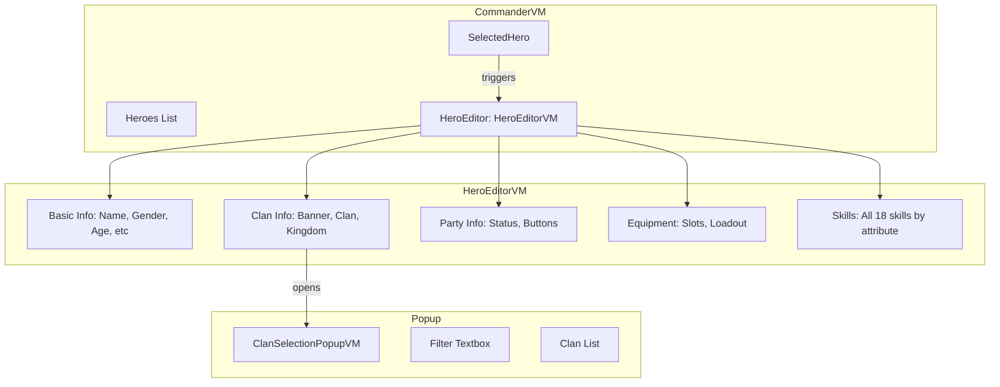

# Hero Editor Panel - Implementation Plan

## Overview

Implementation of a Hero Editor Panel for the Bannerlord.Commander Heroes mode tab. The panel appears to the right of the hero list when a hero is selected, allowing viewing and editing of hero properties.

**Based on Mockup**: [`plans/MockupHero.png`](MockupHero.png)

## Requirements (User Confirmed)

1. **Panel Width Ratio**: Hero list ~55%, Editor panel ~45%
2. **Clan Selection Popup**: Show ALL clans with a filter textbox to search by name
3. **Party Creation**: Use `HeroExtensions.GetHomeOrAlternativeSettlement()` from BLGM API
4. **Skills Display**: Show ALL 18 skills regardless of value (will be editable later)

## Architecture



## Panel Layout

```
+------------------------------------------------------------------+
|                        HERO EDITOR PANEL                          |
+------------------+---------------------+-------------------------+
|   TOP LEFT       |    TOP MIDDLE       |      TOP RIGHT          |
|   - Portrait     |    - Name (edit)    |    - Clan Banner (btn)  |
|   - Gender (RO)  |    - Title (edit)   |    - Clan Name          |
|   - Age (RO)     |                     |    - Kingdom Name       |
|   - Born (RO)    |                     |                         |
|   - Death (RO)   |                     |                         |
|   - Culture (DD) |                     |                         |
+------------------+---------------------+-------------------------+
|                       MIDDLE SECTION                              |
|                     MobileParty Info                              |
|   - In Party? - Party Size - Is Leader?                           |
|   [Disband] [Create/Leave Party] [Edit Party]                     |
+------------------------------------------------------------------+
|   BOTTOM LEFT                    |    BOTTOM RIGHT                |
|   - Loadout DD (Battle/Civ/Stl) |    - Level: X                  |
|   +--+-------+--+                |    - Attributes (6):           |
|   |  |       |  | Equipment      |      VIG (val) + 3 skills      |
|   |  | Hero  |  | Slots (12)     |      CTR (val) + 3 skills      |
|   |  | Prev  |  |                |      END (val) + 3 skills      |
|   +--+-------+--+                |      CNG (val) + 3 skills      |
|                                  |      SOC (val) + 3 skills      |
|                                  |      INT (val) + 3 skills      |
+----------------------------------+--------------------------------+
```

RO = Read Only, DD = Dropdown, btn = button

## Implementation Tasks

### Phase 1: Core ViewModels (Tasks 5-12)

#### Task 5: Create HeroEditorVM.cs
**Location**: `UI/ViewModels/HeroEditor/HeroEditorVM.cs`

**Properties**:
```csharp
// Hero reference
private Hero _hero;

// Basic Info (Top Left)
public string HeroName { get; set; }
public string HeroTitle { get; set; }
public string Gender { get; } // Read-only
public int Age { get; } // Read-only
public string BirthDateText { get; } // Read-only
public string DeathDateText { get; } // Read-only

// Culture Dropdown
public MBBindingList<SelectorItemVM> Cultures { get; }
public SelectorItemVM SelectedCulture { get; set; }

// Clan Info (Top Right)
public ImageIdentifierVM ClanBanner { get; }
public string ClanName { get; }
public string KingdomName { get; }

// Party Info (Middle)
public bool IsInParty { get; }
public bool IsPartyLeader { get; }
public int PartySize { get; }
public string PartyStatusText { get; }
public bool CanDisbandParty { get; }
public bool CanCreateParty { get; }
public bool CanLeaveParty { get; }

// Equipment (Bottom Left)
public int SelectedLoadoutIndex { get; set; } // 0=Battle, 1=Civilian, 2=Stealth
public MBBindingList<SelectorItemVM> LoadoutTypes { get; }
public MBBindingList<HeroEquipmentSlotVM> EquipmentSlots { get; }
public CharacterViewModel HeroCharacter { get; }

// Skills & Attributes (Bottom Right)
public int Level { get; }
public MBBindingList<HeroAttributeVM> Attributes { get; }

// Popup
public ClanSelectionPopupVM ClanSelectionPopup { get; }
```

**Execute Methods**:
- `ExecuteSaveName()` - Call `HeroExtensions.SetStringName()`
- `ExecuteSaveTitle()` - Update hero title property
- `ExecuteChangeCulture()` - Update hero culture
- `ExecuteOpenClanSelection()` - Show clan popup
- `ExecuteDisbandParty()` - Disband hero's party
- `ExecuteCreateOrLeaveParty()` - Create party using `GetHomeOrAlternativeSettlement()` or leave current
- `ExecuteEditParty()` - Placeholder for future
- `ExecuteChangeLoadout()` - Switch equipment loadout view

#### Task 6: Create HeroEquipmentSlotVM.cs
**Location**: `UI/ViewModels/HeroEditor/HeroEquipmentSlotVM.cs`

**Properties**:
```csharp
public EquipmentIndex SlotIndex { get; }
public string SlotName { get; }
public ImageIdentifierVM ItemImage { get; }
public bool HasItem { get; }
public string ItemName { get; }
```

#### Task 7: Create HeroSkillVM.cs
**Location**: `UI/ViewModels/HeroEditor/HeroSkillVM.cs`

**Properties**:
```csharp
public string SkillId { get; }
public string SkillName { get; }
public int SkillValue { get; }
public HintViewModel Hint { get; }
```

#### Task 8: Create HeroAttributeVM.cs
**Location**: `UI/ViewModels/HeroEditor/HeroAttributeVM.cs`

**Properties**:
```csharp
public string AttributeName { get; } // VIG, CTR, END, CNG, SOC, INT
public int AttributeValue { get; }
public MBBindingList<HeroSkillVM> Skills { get; } // 3 skills per attribute
```

#### Task 9: Create ClanSelectionPopupVM.cs
**Location**: `UI/ViewModels/HeroEditor/ClanSelectionPopupVM.cs`

**Properties**:
```csharp
public bool IsVisible { get; set; }
public MBBindingList<ClanItemVM> AllClans { get; }
public string FilterText { get; set; }
private List<ClanItemVM> _allClansUnfiltered;
```

**Methods**:
- `ExecuteClose()` - Hide popup
- `ExecuteSelectClan(ClanItemVM clan)` - Change hero's clan
- `ApplyFilter()` - Filter clan list by name

#### Task 10: Create ClanItemVM.cs
**Location**: `UI/ViewModels/HeroEditor/ClanItemVM.cs`

**Properties**:
```csharp
public Clan Clan { get; }
public string ClanName { get; }
public ImageIdentifierVM Banner { get; }
public string KingdomName { get; }
public bool IsSelected { get; set; }
```

#### Task 11-12: Update CommanderVM.cs
**Modifications**:
1. Add property: `public HeroEditorVM HeroEditor { get; private set; }`
2. Add property: `public bool IsHeroEditorVisible => HeroEditor?.Hero != null;`
3. Update `SelectHero()` method:
   ```csharp
   public void SelectHero(HeroItemVM hero)
   {
       // Existing deselection logic...
       
       _selectedHero = hero;
       if (_selectedHero != null)
       {
           _selectedHero.IsSelected = true;
           
           // Initialize or update HeroEditor
           if (HeroEditor == null)
               HeroEditor = new HeroEditorVM();
           
           HeroEditor.RefreshForHero(_selectedHero.Hero);
       }
       else
       {
           HeroEditor?.Clear();
       }
       
       OnPropertyChanged(nameof(IsHeroEditorVisible));
   }
   ```

### Phase 2: XML Layouts (Tasks 13-18)

#### Task 13: Create HeroEditorPanel.xml
**Location**: `_Module/GUI/Prefabs/HeroEditor/HeroEditorPanel.xml`

**Structure**:
```xml
<Prefab>
  <Window>
    <Widget DataSource="{HeroEditor}" 
            WidthSizePolicy="StretchToParent" 
            HeightSizePolicy="StretchToParent"
            IsVisible="@IsHeroEditorVisible">
      <Children>
        <!-- Background and border -->
        
        <!-- Top Row Container (3 sections) -->
        <ListPanel StackLayout.LayoutMethod="HorizontalLeftToRight">
          <!-- Top-Left: Portrait + Read-Only Info -->
          <!-- Top-Middle: Editable Name + Title -->
          <!-- Top-Right: Clan Banner + Info -->
        </ListPanel>
        
        <!-- Middle Row: Party Info + Buttons -->
        
        <!-- Bottom Row Container (2 sections) -->
        <ListPanel StackLayout.LayoutMethod="HorizontalLeftToRight">
          <!-- Bottom-Left: Equipment Preview + Slots -->
          <!-- Bottom-Right: Level + Skills Grid -->
        </ListPanel>
        
        <!-- Clan Selection Popup -->
        <ClanSelectionPopup DataSource="{ClanSelectionPopup}" />
      </Children>
    </Widget>
  </Window>
</Prefab>
```

#### Task 14: Create HeroEquipmentSlot.xml
**Location**: `_Module/GUI/Prefabs/HeroEditor/HeroEquipmentSlot.xml`

Based on [`InventoryEquippedItemSlot.xml`](../Examples/Inventory_GUI/Prefabs/Inventory/InventoryEquippedItemSlot.xml)

#### Task 15: Create HeroSkillItem.xml
**Location**: `_Module/GUI/Prefabs/HeroEditor/HeroSkillItem.xml`

```xml
<Prefab>
  <Window>
    <Widget WidthSizePolicy="Fixed" HeightSizePolicy="Fixed" 
            SuggestedWidth="70" SuggestedHeight="90">
      <Children>
        <SkillIconVisualWidget WidthSizePolicy="Fixed" HeightSizePolicy="Fixed"
                               SuggestedWidth="44" SuggestedHeight="44"
                               SkillId="@SkillId" UseSmallVariation="true">
          <Children>
            <TextWidget IntText="@SkillValue" 
                       Brush="Encyclopedia.Skill.Text" 
                       VerticalAlignment="Bottom" 
                       PositionYOffset="25"/>
            <HintWidget DataSource="{Hint}" 
                       Command.HoverBegin="ExecuteBeginHint"
                       Command.HoverEnd="ExecuteEndHint"/>
          </Children>
        </SkillIconVisualWidget>
      </Children>
    </Widget>
  </Window>
</Prefab>
```

#### Task 16: Create ClanSelectionPopup.xml
**Location**: `_Module/GUI/Prefabs/HeroEditor/ClanSelectionPopup.xml`

**Structure**:
```xml
<Prefab>
  <Window>
    <Widget WidthSizePolicy="StretchToParent" HeightSizePolicy="StretchToParent"
            IsVisible="@IsVisible">
      <!-- Dark background overlay -->
      <ButtonWidget Command.Click="ExecuteClose" />
      
      <!-- Popup container -->
      <Widget WidthSizePolicy="Fixed" HeightSizePolicy="Fixed"
              SuggestedWidth="600" SuggestedHeight="700"
              HorizontalAlignment="Center" VerticalAlignment="Center">
        <Children>
          <!-- Header with title -->
          <TextWidget Text="Select Clan" />
          
          <!-- Filter textbox -->
          <EditableTextWidget Text="@FilterText" />
          
          <!-- Scrollable clan list -->
          <ScrollablePanel>
            <ListPanel DataSource="{AllClans}">
              <ItemTemplate>
                <!-- Clan item with banner, name, kingdom -->
              </ItemTemplate>
            </ListPanel>
          </ScrollablePanel>
          
          <!-- Close button -->
          <ButtonWidget Command.Click="ExecuteClose" />
        </Children>
      </Widget>
    </Widget>
  </Window>
</Prefab>
```

#### Task 17: Update CommanderScreen.xml
**Modification**:

Change Heroes mode content from single panel to split layout:
```xml
<!-- HEROES MODE CONTENT -->
<Widget IsVisible="@IsHeroesSelected">
  <Children>
    <!-- Horizontal split container -->
    <ListPanel StackLayout.LayoutMethod="HorizontalLeftToRight">
      
      <!-- Left: Hero List (55%) -->
      <Widget WidthSizePolicy="StretchToParent" 
              HeightSizePolicy="StretchToParent"
              MarginRight="10">
        <!-- Existing hero list content -->
      </Widget>
      
      <!-- Right: Hero Editor (45%) -->
      <Widget WidthSizePolicy="Fixed" 
              HeightSizePolicy="StretchToParent"
              SuggestedWidth="800"
              IsVisible="@IsHeroEditorVisible">
        <HeroEditorPanel DataSource="{HeroEditor}" />
      </Widget>
      
    </ListPanel>
  </Children>
</Widget>
```

#### Task 18: Add brushes to CommanderBrushes.xml
**New Brushes**:
- `HeroEditor.Panel.Background`
- `HeroEditor.Section.Border`
- `HeroEditor.Button.Standard`
- `HeroEditor.EquipmentSlot.Background`
- `HeroEditor.SkillGrid.Background`

### Phase 3: Functionality (Tasks 19-29)

#### Task 19: Implement Name Editing
In `HeroEditorVM.ExecuteSaveName()`:
```csharp
public void ExecuteSaveName()
{
    if (_hero != null && !string.IsNullOrEmpty(HeroName))
    {
        _hero.SetStringName(HeroName);
        OnPropertyChanged(nameof(HeroName));
    }
}
```

#### Task 20: Implement Title Editing
In `HeroEditorVM.ExecuteSaveTitle()`:
```csharp
public void ExecuteSaveTitle()
{
    if (_hero != null)
    {
        // Update hero's name with title
        // Note: Bannerlord stores title as part of FirstName property
        _hero.FirstName = new TextObject(HeroTitle);
        OnPropertyChanged(nameof(HeroTitle));
    }
}
```

#### Task 21: Implement Culture Dropdown
Populate cultures in `HeroEditorVM`:
```csharp
private void InitializeCultures()
{
    Cultures.Clear();
    foreach (var culture in CultureObject.All)
    {
        Cultures.Add(new SelectorItemVM(culture.Name.ToString(), culture));
    }
}

public void ExecuteChangeCulture()
{
    if (_hero != null && SelectedCulture?.Item is CultureObject culture)
    {
        _hero.Culture = culture;
        RefreshClanInfo(); // Update clan/kingdom display
    }
}
```

#### Task 22: Implement Clan Banner Click
```csharp
public void ExecuteOpenClanSelection()
{
    ClanSelectionPopup.ShowPopup(_hero);
}
```

#### Task 23-25: Implement Party Info and Actions
```csharp
// Display properties
public bool IsInParty => _hero?.PartyBelongedTo != null;
public bool IsPartyLeader => _hero?.PartyBelongedTo?.Leader == _hero;
public int PartySize => _hero?.PartyBelongedTo?.MemberRoster.TotalManCount ?? 0;
public string PartyStatusText => IsInParty 
    ? $"In Party ({PartySize})" + (IsPartyLeader ? " - Leader" : "")
    : "Not in Party";

// Actions
public void ExecuteDisbandParty()
{
    if (_hero?.PartyBelongedTo != null && IsPartyLeader)
    {
        _hero.PartyBelongedTo.RemoveParty();
        RefreshPartyInfo();
    }
}

public void ExecuteCreateOrLeaveParty()
{
    if (!IsInParty)
    {
        // Create party
        var settlement = _hero.GetHomeOrAlternativeSettlement();
        _hero.CreateParty(settlement);
    }
    else if (!IsPartyLeader)
    {
        // Leave party
        _hero.PartyBelongedTo.MemberRoster.RemoveTroop(_hero.CharacterObject);
    }
    RefreshPartyInfo();
}
```

#### Task 26: Implement Equipment Display
```csharp
private void InitializeEquipment()
{
    EquipmentSlots.Clear();
    
    var equipment = _hero.BattleEquipment; // or CivilianEquipment based on loadout
    
    for (int i = 0; i < 12; i++) // All equipment slots
    {
        var slot = new HeroEquipmentSlotVM((EquipmentIndex)i, equipment[i]);
        EquipmentSlots.Add(slot);
    }
    
    // Initialize character preview
    HeroCharacter = new CharacterViewModel();
    HeroCharacter.FillFrom(_hero);
}

public void ExecuteChangeLoadout()
{
    RefreshEquipment(); // Reload equipment for selected loadout
}
```

#### Task 27-28: Implement Skills and Attributes
```csharp
private void InitializeSkillsAndAttributes()
{
    Attributes.Clear();
    
    // 6 Attributes, each with 3 skills (18 total)
    var attributeGroups = new[]
    {
        ("Vigor", new[] { "OneHanded", "TwoHanded", "Polearm" }),
        ("Control", new[] { "Bow", "Crossbow", "Throwing" }),
        ("Endurance", new[] { "Riding", "Athletics", "Smithing" }),
        ("Cunning", new[] { "Scouting", "Tactics", "Roguery" }),
        ("Social", new[] { "Charm", "Leadership", "Trade" }),
        ("Intelligence", new[] { "Steward", "Medicine", "Engineering" })
    };
    
    foreach (var (attrName, skillIds) in attributeGroups)
    {
        var attrVM = new HeroAttributeVM(attrName, _hero);
        
        foreach (var skillId in skillIds)
        {
            var skill = Skills.All.FirstOrDefault(s => s.StringId == skillId);
            if (skill != null)
            {
                var skillValue = _hero.GetSkillValue(skill);
                attrVM.Skills.Add(new HeroSkillVM(skill, skillValue));
            }
        }
        
        Attributes.Add(attrVM);
    }
}
```

#### Task 29: Wire Up Panel Visibility
Already handled in Task 11-12 via `IsHeroEditorVisible` property.

## Native Widget References

### Character Portrait
From [`ClanMembers.xml:55`](../Examples/Sandbox_GUI/Prefabs/Clan/ClanMembers.xml#L55):
```xml
<CharacterTableauWidget DataSource="{HeroModel}" 
    BannerCodeText="@BannerCodeText" 
    BodyProperties="@BodyProperties"
    CharStringId="@CharStringId"
    EquipmentCode="@EquipmentCode"
    IsFemale="@IsFemale"
    StanceIndex="@StanceIndex"
    ArmorColor1="@ArmorColor1"
    ArmorColor2="@ArmorColor2"
    Race="@Race"/>
```

### Skills Grid
From [`CharacterDeveloper.xml:638`](../Examples/Sandbox_GUI/Prefabs/CharacterDeveloper/CharacterDeveloper.xml#L638):
```xml
<NavigatableGridWidget DataSource="{Skills}"
    DefaultCellWidth="178" 
    DefaultCellHeight="117.5" 
    ColumnCount="3">
    <ItemTemplate>
        <SkillGridItem/>
    </ItemTemplate>
</NavigatableGridWidget>
```

### Equipment Slot
From [`InventoryEquippedItemSlot.xml:24`](../Examples/Inventory_GUI/Prefabs/Inventory/InventoryEquippedItemSlot.xml#L24):
```xml
<InventoryEquippedItemSlotWidget 
    DataSource="*ItemDataSource"
    TargetEquipmentIndex="*EquipmentIndex"
    ImageIdentifier="ImageIdentifier"
    IsSelected="@IsSelected">
```

## Testing Checklist

- [ ] Panel appears when hero selected from list
- [ ] Panel hides when hero deselected or filtered out
- [ ] Portrait displays correctly
- [ ] Name editing saves and persists
- [ ] Title editing saves and persists
- [ ] Culture dropdown shows all cultures
- [ ] Culture change updates hero
- [ ] Clan banner displays correct clan
- [ ] Clan selection popup opens with all clans
- [ ] Clan filter textbox works
- [ ] Clan selection updates hero's clan
- [ ] Party info displays correctly
- [ ] Disband button works when applicable
- [ ] Create party button works
- [ ] Leave party button works
- [ ] Equipment slots show correct items
- [ ] Loadout dropdown switches between Battle/Civilian/Stealth
- [ ] Character preview updates with equipment
- [ ] All 18 skills display with correct values
- [ ] All 6 attributes display with values
- [ ] Level displays correctly
- [ ] No UI freezing or stalls

## File Summary

### New Files (10)
1. `UI/ViewModels/HeroEditor/HeroEditorVM.cs`
2. `UI/ViewModels/HeroEditor/HeroEquipmentSlotVM.cs`
3. `UI/ViewModels/HeroEditor/HeroSkillVM.cs`
4. `UI/ViewModels/HeroEditor/HeroAttributeVM.cs`
5. `UI/ViewModels/HeroEditor/ClanSelectionPopupVM.cs`
6. `UI/ViewModels/HeroEditor/ClanItemVM.cs`
7. `_Module/GUI/Prefabs/HeroEditor/HeroEditorPanel.xml`
8. `_Module/GUI/Prefabs/HeroEditor/HeroEquipmentSlot.xml`
9. `_Module/GUI/Prefabs/HeroEditor/HeroSkillItem.xml`
10. `_Module/GUI/Prefabs/HeroEditor/ClanSelectionPopup.xml`

### Modified Files (3)
1. `UI/ViewModels/CommanderVM.cs`
2. `_Module/GUI/Prefabs/CommanderScreen.xml`
3. `_Module/GUI/Brushes/CommanderBrushes.xml`

## Notes

- Equipment slot clicking is placeholder for future implementation
- Edit Party button is placeholder for future implementation
- Skills and attributes are read-only for now (editable in future)
- Use async/deferred loading to prevent UI stalls
- Follow existing patterns from native UI for consistency
