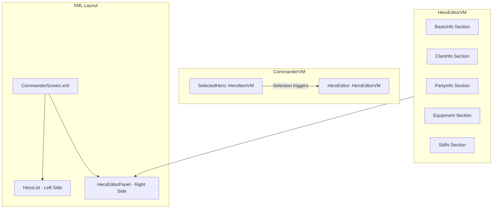

# Hero Editor Panel Implementation Plan

## Overview

This plan details the implementation of a Hero Editor Panel for the Bannerlord.Commander Heroes mode tab. The panel will appear to the right of the hero list when a hero is selected, allowing viewing and editing of hero properties.

## Architecture Diagram



## Panel Layout Structure

Based on the mockup, the panel will be organized into distinct regions:

```
+------------------------------------------------------------------+
|                        HERO EDITOR PANEL                          |
+------------------+---------------------+-------------------------+
|   TOP LEFT       |    TOP MIDDLE       |      TOP RIGHT          |
|   - Portrait     |    - Name (edit)    |    - Clan Banner        |
|   - Gender       |    - Title (edit)   |    - Clan Name          |
|   - Age          |                     |    - Kingdom Name       |
|   - Date Born    |                     |                         |
|   - Death Date   |                     |                         |
|   - Culture DD   |                     |                         |
+------------------+---------------------+-------------------------+
|                       MIDDLE SECTION                              |
|                     MobileParty Info                              |
|   - Party Status - In Party? - Party Size - Is Leader?            |
|   [Disband] [Create/Leave Party] [Edit Party]                     |
+------------------------------------------------------------------+
|   BOTTOM LEFT                    |    BOTTOM RIGHT                |
|   - Loadout Dropdown             |    - Level: X                  |
|   +--+-------+--+                 |    - Attributes Grid           |
|   |  |       |  | Equipment      |    - Skills Grid               |
|   |  | Hero  |  | Slots          |      - VIG: OneHanded, etc     |
|   |  | Prev  |  |                |      - CTR: Crossbow, etc      |
|   |  |       |  |                |      - END: Riding, etc        |
|   +--+-------+--+                 |      - CNG: Scouting, etc      |
|                                   |      - SOC: Charm, etc         |
|                                   |      - INT: Steward, etc       |
+-----------------------------------+-------------------------------+
```

## Files to Create/Modify

### New ViewModel Files

1. **`UI/ViewModels/HeroEditor/HeroEditorVM.cs`**
   - Main ViewModel for the hero editor panel
   - Holds reference to selected Hero object
   - Contains all editable properties and Execute methods
   - Properties: Name, Title, Gender, Age, BirthDate, DeathDate, Culture, ClanBanner, etc.

2. **`UI/ViewModels/HeroEditor/HeroEquipmentSlotVM.cs`**
   - ViewModel for individual equipment slots
   - Properties: SlotType, EquippedItem, ItemImageId
   - Execute methods for future item selection

3. **`UI/ViewModels/HeroEditor/HeroSkillVM.cs`**
   - ViewModel for skill display
   - Properties: SkillId, SkillName, SkillValue, SkillIcon

4. **`UI/ViewModels/HeroEditor/HeroAttributeVM.cs`**
   - ViewModel for attribute groups
   - Properties: AttributeName, AttributeValue, Skills list

5. **`UI/ViewModels/HeroEditor/ClanSelectionPopupVM.cs`**
   - ViewModel for clan selection popup
   - Properties: AvailableClans list, SelectedClan
   - Execute methods: SelectClan, ClosePopup

### New XML Prefab Files

1. **`_Module/GUI/Prefabs/HeroEditor/HeroEditorPanel.xml`**
   - Main panel layout with all sections
   - References sub-prefabs for complex widgets

2. **`_Module/GUI/Prefabs/HeroEditor/HeroEquipmentSlot.xml`**
   - Reusable equipment slot widget
   - Parameters for slot type and item binding

3. **`_Module/GUI/Prefabs/HeroEditor/HeroSkillItem.xml`**
   - Skill display widget with icon and value

4. **`_Module/GUI/Prefabs/HeroEditor/ClanSelectionPopup.xml`**
   - Modal popup for selecting clans
   - Scrollable list of available clans with banners

### Modified Files

1. **`UI/ViewModels/CommanderVM.cs`**
   - Add HeroEditor property of type HeroEditorVM
   - Update SelectHero method to populate HeroEditorVM
   - Add IsHeroEditorVisible property

2. **`_Module/GUI/Prefabs/CommanderScreen.xml`**
   - Modify Heroes mode content layout
   - Split into left panel (hero list) and right panel (hero editor)
   - Add HeroEditorPanel binding

3. **`_Module/GUI/Brushes/CommanderBrushes.xml`**
   - Add brushes for editor panel styling
   - Equipment slot brushes
   - Skill grid brushes

## Detailed Implementation Steps

### Phase 1: Core ViewModel Structure

1. Create `HeroEditorVM.cs` with basic properties:
   ```csharp
   public class HeroEditorVM : ViewModel
   {
       private Hero _hero;
       
       // Basic Info
       public string HeroName { get; set; }
       public string HeroTitle { get; set; }
       public string Gender { get; }
       public int Age { get; }
       public string BirthDateText { get; }
       public string DeathDateText { get; }
       
       // Culture
       public MBBindingList<CultureSelectorItemVM> Cultures { get; }
       public CultureSelectorItemVM SelectedCulture { get; set; }
       
       // Clan Info
       public ImageIdentifierVM ClanBanner { get; }
       public string ClanName { get; }
       public string KingdomName { get; }
       
       // Party Info
       public bool IsInParty { get; }
       public bool IsPartyLeader { get; }
       public int PartySize { get; }
       public string PartyStatusText { get; }
       
       // Equipment
       public int SelectedLoadoutIndex { get; set; }
       public MBBindingList<HeroEquipmentSlotVM> EquipmentSlots { get; }
       public CharacterViewModel HeroCharacter { get; }
       
       // Skills & Attributes
       public int Level { get; }
       public MBBindingList<HeroAttributeVM> Attributes { get; }
       
       // Commands
       public void ExecuteSaveName();
       public void ExecuteSaveTitle();
       public void ExecuteChangeCulture();
       public void ExecuteOpenClanSelection();
       public void ExecuteDisbandParty();
       public void ExecuteCreateOrLeaveParty();
       public void ExecuteEditParty();
       public void ExecuteChangeLoadout();
   }
   ```

2. Create supporting ViewModels for sub-sections

### Phase 2: XML Layout Implementation

1. Update `CommanderScreen.xml` Heroes section to use split layout:
   - Hero list takes approximately 55% width on left
   - Hero editor panel takes approximately 45% width on right
   - Editor panel only visible when `IsHeroEditorVisible` is true

2. Create `HeroEditorPanel.xml` with structured layout matching mockup

### Phase 3: Widget Integration

Key native widgets to use:

- **`ImageIdentifierWidget`** - For hero portrait and clan banner
- **`CharacterTableauWidget`** - For live hero preview
- **`SkillIconVisualWidget`** - For skill icons
- **`EditableTextWidget`** - For editable name/title fields
- **`DropdownWidget`** - For culture and loadout selection
- **`ButtonWidget`** - For action buttons

### Phase 4: Data Binding and Functionality

1. Wire up property change notifications
2. Implement save methods that call BLGM APIs:
   - `HeroExtensions.SetStringName()` for name changes
   - Culture changes through direct Hero property modification
   - Party operations via `MobilePartyExtensions`

## Native Widget References

Based on analyzed examples:

### Portrait Widget Pattern (from ClanMembers.xml)
```xml
<CharacterTableauWidget DataSource="{HeroModel}" 
    WidthSizePolicy="Fixed" HeightSizePolicy="Fixed" 
    SuggestedWidth="600" SuggestedHeight="1000"
    BannerCodeText="@BannerCodeText" 
    BodyProperties="@BodyProperties"
    CharStringId="@CharStringId"
    EquipmentCode="@EquipmentCode"
    IsFemale="@IsFemale"
    StanceIndex="@StanceIndex"
    ArmorColor1="@ArmorColor1"
    ArmorColor2="@ArmorColor2"
    Race="@Race"/>
```

### Skills Grid Pattern (from CharacterDeveloper.xml)
```xml
<NavigatableGridWidget DataSource="{Skills}"
    WidthSizePolicy="CoverChildren" 
    HeightSizePolicy="CoverChildren"
    DefaultCellWidth="178" 
    DefaultCellHeight="137" 
    ColumnCount="3">
    <ItemTemplate>
        <SkillGridItem/>
    </ItemTemplate>
</NavigatableGridWidget>
```

### Equipment Slot Pattern (from InventoryEquippedItemSlot.xml)
```xml
<InventoryEquippedItemSlotWidget 
    DataSource="*ItemDataSource"
    TargetEquipmentIndex="*EquipmentIndex"
    ItemType="@TypeName"
    AcceptDrag="true"
    ImageIdentifier="ImageIdentifier"
    IsSelected="@IsSelected"
    Command.Click="ExecuteSelectItem">
```

## Equipment Slots Layout

Based on standard Bannerlord inventory:

| Left Side | Preview | Right Side |
|-----------|---------|------------|
| Helm      |         | Horse      |
| Cape      |  Hero   | Harness    |
| Body      | Preview | Weapon 1   |
| Gloves    |         | Weapon 2   |
| Boots     |         | Weapon 3   |
| Leg       |         | Weapon 4   |

## Loadout Types

Equipment loadout dropdown options:
1. **Battle** (Index 0) - Default combat equipment
2. **Civilian** (Index 1) - Town/peaceful equipment
3. **Stealth** (Index 2) - Stealth mission equipment

## Testing Checklist

- [ ] Panel appears when hero is selected
- [ ] Panel hides when hero is deselected or filter removes selection
- [ ] Portrait displays correctly for selected hero
- [ ] Name editing works and persists
- [ ] Title editing works and persists
- [ ] Culture dropdown populates with all cultures
- [ ] Culture change updates hero's culture
- [ ] Clan banner displays correctly
- [ ] Clan selection popup opens and works
- [ ] Party info displays correctly
- [ ] Party action buttons work appropriately
- [ ] Equipment slots display correct items
- [ ] Loadout dropdown switches equipment view
- [ ] Skills display with correct values
- [ ] Attributes display correctly
- [ ] Level displays correctly
- [ ] Panel scrolls if content overflows
- [ ] No UI freezing during data loading

## Notes

- The edit party functionality is explicitly noted to be a placeholder button for future implementation
- Equipment slots should be clickable but don't need functional item selection yet
- Skills and attributes are read-only display for this implementation
- Use async loading where possible to prevent UI stalls
- Follow existing patterns from native UI for consistent look and feel
