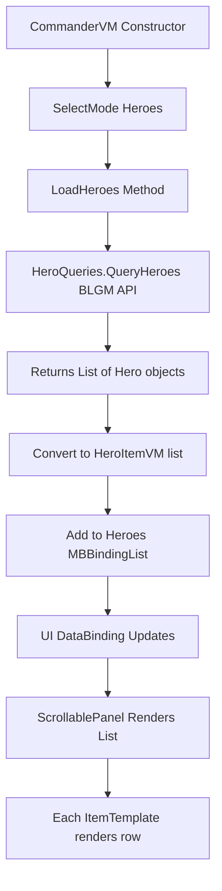

# Hero Query Scroll View Implementation Plan

## Current State Analysis

### CommanderVM.cs
- **Current default mode**: Kingdoms (line 49)
- **Structure**: Has mode selection booleans and Execute methods for each tab
- **Missing**: Hero data collection and BLGM integration

### CommanderScreen.xml
- **Layout**: Header (60px), Tabs (42px), Content Area (dynamic), Footer (50px)
- **Content Area**: Lines 324-334 - Currently empty placeholder
- **Available space**: Full screen minus 104px top, 60px bottom, 40px horizontal margins

### CommanderGauntletScreen.cs
- **Pattern**: Standard Gauntlet screen initialization
- **No changes needed**: Screen logic is generic enough

### BLGM API Available
- **HeroQueries.QueryHeroes()**: Returns List&lt;Hero&gt;
  - Parameters: query, requiredTypes, matchAll, includeDead, sortBy, sortDescending
- **Hero object properties**:
  - Name: TextObject (use .ToString())
  - Culture: CultureObject (use .Name.ToString())
  - Level: int
  - IsFemale: bool (convert to "Male"/"Female")
  - Clan: Clan object (use .Name.ToString() or "None")
  - Clan.Kingdom: Kingdom object (use .Name.ToString() or "None")

---

## Implementation Steps

### 1. Change Default Mode to Heroes

**File**: [`Bannerlord.Commander/UI/CommanderVM.cs`](Bannerlord.Commander/UI/CommanderVM.cs:49)

**Change**: Line 49
```csharp
// FROM:
SelectMode(CommanderMode.Kingdoms);

// TO:
SelectMode(CommanderMode.Heroes);
```

---

### 2. Create HeroItemVM Class

**File**: [`Bannerlord.Commander/UI/CommanderVM.cs`](Bannerlord.Commander/UI/CommanderVM.cs) (add new class at end before closing namespace)

**Purpose**: ViewModel for individual hero row in the scroll view

**Properties Required**:
```csharp
public class HeroItemVM : ViewModel
{
    private string _name;
    private string _culture;
    private string _level;
    private string _gender;
    private string _clan;
    private string _kingdom;

    [DataSourceProperty]
    public string Name { get; set; }

    [DataSourceProperty]
    public string Culture { get; set; }

    [DataSourceProperty]
    public string Level { get; set; }

    [DataSourceProperty]
    public string Gender { get; set; }

    [DataSourceProperty]
    public string Clan { get; set; }

    [DataSourceProperty]
    public string Kingdom { get; set; }
}
```

**Constructor**: Accept Hero object and extract properties
```csharp
public HeroItemVM(Hero hero)
{
    Name = hero.Name?.ToString() ?? "Unknown";
    Culture = hero.Culture?.Name?.ToString() ?? "Unknown";
    Level = hero.Level.ToString();
    Gender = hero.IsFemale ? "Female" : "Male";
    Clan = hero.Clan?.Name?.ToString() ?? "None";
    Kingdom = hero.Clan?.Kingdom?.Name?.ToString() ?? "None";
}
```

---

### 3. Add Heroes Collection to CommanderVM

**File**: [`Bannerlord.Commander/UI/CommanderVM.cs`](Bannerlord.Commander/UI/CommanderVM.cs)

**Add using statement** at top:
```csharp
using TaleWorlds.CampaignSystem;
using TaleWorlds.CampaignSystem.ViewModelCollection;
using Bannerlord.GameMaster.Heroes;
```

**Add private field** (around line 27):
```csharp
private MBBindingList<HeroItemVM> _heroes;
```

**Add property** (after line 218):
```csharp
[DataSourceProperty]
public MBBindingList<HeroItemVM> Heroes
{
    get => _heroes;
    set
    {
        if (_heroes != value)
        {
            _heroes = value;
            OnPropertyChangedWithValue(value, nameof(Heroes));
        }
    }
}
```

**Initialize in constructor** (line 42):
```csharp
public CommanderVM()
{
    // Get version from assembly, fallback to hardcoded if not available
    var version = GetVersionString();
    TitleText = $"COMMANDER {version}";
    
    // Initialize empty heroes collection
    Heroes = new MBBindingList<HeroItemVM>();
    
    // Default to Heroes mode selected
    SelectMode(CommanderMode.Heroes);
}
```

---

### 4. Add LoadHeroes Method

**File**: [`Bannerlord.Commander/UI/CommanderVM.cs`](Bannerlord.Commander/UI/CommanderVM.cs)

**Add method** (before OnFinalize):
```csharp
/// <summary>
/// Load all alive heroes from the game using BLGM HeroQueries
/// </summary>
private void LoadHeroes()
{
    Heroes.Clear();
    
    // Query all alive heroes using BLGM API
    var allHeroes = HeroQueries.QueryHeroes(
        query: "",
        requiredTypes: HeroTypes.Alive,
        matchAll: true,
        includeDead: false,
        sortBy: "id",
        sortDescending: false
    );
    
    // Convert to ViewModels and add to collection
    foreach (var hero in allHeroes)
    {
        Heroes.Add(new HeroItemVM(hero));
    }
}
```

---

### 5. Update SelectMode to Load Heroes

**File**: [`Bannerlord.Commander/UI/CommanderVM.cs`](Bannerlord.Commander/UI/CommanderVM.cs:75)

**Modify SelectMode method** (around line 75):
```csharp
private void SelectMode(CommanderMode mode)
{
    _selectedMode = mode;
    
    // Update all selection states
    IsKingdomsSelected = mode == CommanderMode.Kingdoms;
    IsClansSelected = mode == CommanderMode.Clans;
    IsHeroesSelected = mode == CommanderMode.Heroes;
    IsSettlementsSelected = mode == CommanderMode.Settlements;
    IsTroopsSelected = mode == CommanderMode.Troops;
    IsItemsSelected = mode == CommanderMode.Items;
    IsCharactersSelected = mode == CommanderMode.Characters;
    
    // Update the selected mode name
    SelectedModeName = mode.ToString();
    
    // Load data for the selected mode
    if (mode == CommanderMode.Heroes)
    {
        LoadHeroes();
    }
}
```

---

### 6. Update OnFinalize to Clear Heroes

**File**: [`Bannerlord.Commander/UI/CommanderVM.cs`](Bannerlord.Commander/UI/CommanderVM.cs:290)

**Modify OnFinalize** (around line 290):
```csharp
public override void OnFinalize()
{
    base.OnFinalize();
    OnCloseRequested = null;
    
    // Clean up heroes collection
    if (Heroes != null)
    {
        Heroes.Clear();
        Heroes = null;
    }
}
```

---

### 7. Create Hero Scroll View UI

**File**: [`Bannerlord.Commander/_Module/GUI/Prefabs/CommanderScreen.xml`](Bannerlord.Commander/_Module/GUI/Prefabs/CommanderScreen.xml:324)

**Replace Main Content Area** (lines 324-334) with:

```xml
<!-- Main Content Area (below mode tabs) -->
<Widget WidthSizePolicy="StretchToParent"
        HeightSizePolicy="StretchToParent"
        MarginTop="104"
        MarginBottom="60"
        MarginLeft="20"
        MarginRight="20">
  <Children>
    
    <!-- HEROES MODE CONTENT -->
    <Widget WidthSizePolicy="StretchToParent"
            HeightSizePolicy="StretchToParent"
            IsVisible="@IsHeroesSelected">
      <Children>
        
        <!-- Container with border -->
        <Widget WidthSizePolicy="StretchToParent"
                HeightSizePolicy="StretchToParent"
                Sprite="BlankWhiteSquare_9"
                Color="#2a2a2aFF">
          <Children>
            
            <!-- Border frame -->
            <Widget WidthSizePolicy="StretchToParent" HeightSizePolicy="Fixed"
                    SuggestedHeight="2" VerticalAlignment="Top"
                    Sprite="BlankWhiteSquare_9" Color="#8B7355FF" />
            <Widget WidthSizePolicy="StretchToParent" HeightSizePolicy="Fixed"
                    SuggestedHeight="2" VerticalAlignment="Bottom"
                    Sprite="BlankWhiteSquare_9" Color="#8B7355FF" />
            <Widget WidthSizePolicy="Fixed" HeightSizePolicy="StretchToParent"
                    SuggestedWidth="2" HorizontalAlignment="Left"
                    Sprite="BlankWhiteSquare_9" Color="#8B7355FF" />
            <Widget WidthSizePolicy="Fixed" HeightSizePolicy="StretchToParent"
                    SuggestedWidth="2" HorizontalAlignment="Right"
                    Sprite="BlankWhiteSquare_9" Color="#8B7355FF" />
            
            <!-- Content area with margin -->
            <Widget WidthSizePolicy="StretchToParent"
                    HeightSizePolicy="StretchToParent"
                    MarginTop="10"
                    MarginBottom="10"
                    MarginLeft="10"
                    MarginRight="10">
              <Children>
                
                <!-- Column Headers -->
                <Widget WidthSizePolicy="StretchToParent"
                        HeightSizePolicy="Fixed"
                        SuggestedHeight="40"
                        VerticalAlignment="Top"
                        Sprite="BlankWhiteSquare_9"
                        Color="#3a3a3aFF">
                  <Children>
                    <!-- Header Row Layout -->
                    <ListPanel WidthSizePolicy="StretchToParent"
                               HeightSizePolicy="StretchToParent"
                               LayoutImp.LayoutMethod="HorizontalLeftToRight">
                      <Children>
                        
                        <!-- Name Column Header -->
                        <Widget WidthSizePolicy="Fixed"
                                HeightSizePolicy="StretchToParent"
                                SuggestedWidth="250"
                                MarginLeft="10">
                          <Children>
                            <TextWidget WidthSizePolicy="StretchToParent"
                                        HeightSizePolicy="StretchToParent"
                                        Brush="TownManagement.Description.Title.Text"
                                        Brush.FontSize="20"
                                        Text="Name"
                                        HorizontalAlignment="Left"
                                        VerticalAlignment="Center" />
                          </Children>
                        </Widget>
                        
                        <!-- Culture Column Header -->
                        <Widget WidthSizePolicy="Fixed"
                                HeightSizePolicy="StretchToParent"
                                SuggestedWidth="150"
                                MarginLeft="10">
                          <Children>
                            <TextWidget WidthSizePolicy="StretchToParent"
                                        HeightSizePolicy="StretchToParent"
                                        Brush="TownManagement.Description.Title.Text"
                                        Brush.FontSize="20"
                                        Text="Culture"
                                        HorizontalAlignment="Left"
                                        VerticalAlignment="Center" />
                          </Children>
                        </Widget>
                        
                        <!-- Level Column Header -->
                        <Widget WidthSizePolicy="Fixed"
                                HeightSizePolicy="StretchToParent"
                                SuggestedWidth="80"
                                MarginLeft="10">
                          <Children>
                            <TextWidget WidthSizePolicy="StretchToParent"
                                        HeightSizePolicy="StretchToParent"
                                        Brush="TownManagement.Description.Title.Text"
                                        Brush.FontSize="20"
                                        Text="Level"
                                        HorizontalAlignment="Center"
                                        VerticalAlignment="Center" />
                          </Children>
                        </Widget>
                        
                        <!-- Gender Column Header -->
                        <Widget WidthSizePolicy="Fixed"
                                HeightSizePolicy="StretchToParent"
                                SuggestedWidth="100"
                                MarginLeft="10">
                          <Children>
                            <TextWidget WidthSizePolicy="StretchToParent"
                                        HeightSizePolicy="StretchToParent"
                                        Brush="TownManagement.Description.Title.Text"
                                        Brush.FontSize="20"
                                        Text="Gender"
                                        HorizontalAlignment="Left"
                                        VerticalAlignment="Center" />
                          </Children>
                        </Widget>
                        
                        <!-- Clan Column Header -->
                        <Widget WidthSizePolicy="Fixed"
                                HeightSizePolicy="StretchToParent"
                                SuggestedWidth="200"
                                MarginLeft="10">
                          <Children>
                            <TextWidget WidthSizePolicy="StretchToParent"
                                        HeightSizePolicy="StretchToParent"
                                        Brush="TownManagement.Description.Title.Text"
                                        Brush.FontSize="20"
                                        Text="Clan"
                                        HorizontalAlignment="Left"
                                        VerticalAlignment="Center" />
                          </Children>
                        </Widget>
                        
                        <!-- Kingdom Column Header -->
                        <Widget WidthSizePolicy="Fixed"
                                HeightSizePolicy="StretchToParent"
                                SuggestedWidth="200"
                                MarginLeft="10">
                          <Children>
                            <TextWidget WidthSizePolicy="StretchToParent"
                                        HeightSizePolicy="StretchToParent"
                                        Brush="TownManagement.Description.Title.Text"
                                        Brush.FontSize="20"
                                        Text="Kingdom"
                                        HorizontalAlignment="Left"
                                        VerticalAlignment="Center" />
                          </Children>
                        </Widget>
                        
                      </Children>
                    </ListPanel>
                    
                    <!-- Bottom border for header -->
                    <Widget WidthSizePolicy="StretchToParent"
                            HeightSizePolicy="Fixed"
                            SuggestedHeight="2"
                            VerticalAlignment="Bottom"
                            Sprite="BlankWhiteSquare_9"
                            Color="#8B7355FF" />
                  </Children>
                </Widget>
                
                <!-- Scrollable Data Rows -->
                <ScrollablePanel WidthSizePolicy="StretchToParent"
                                 HeightSizePolicy="StretchToParent"
                                 MarginTop="42"
                                 ClipContents="true">
                  <Children>
                    
                    <!-- Heroes List -->
                    <ListPanel WidthSizePolicy="StretchToParent"
                               HeightSizePolicy="CoverChildren"
                               DataSource="{Heroes}"
                               LayoutImp.LayoutMethod="VerticalBottomToTop">
                      <ItemTemplate>
                        
                        <!-- Hero Row -->
                        <Widget WidthSizePolicy="StretchToParent"
                                HeightSizePolicy="Fixed"
                                SuggestedHeight="35"
                                MarginBottom="2">
                          <Children>
                            
                            <!-- Row background -->
                            <Widget WidthSizePolicy="StretchToParent"
                                    HeightSizePolicy="StretchToParent"
                                    Sprite="BlankWhiteSquare_9"
                                    Color="#1E1E1EFF" />
                            
                            <!-- Row data layout -->
                            <ListPanel WidthSizePolicy="StretchToParent"
                                       HeightSizePolicy="StretchToParent"
                                       LayoutImp.LayoutMethod="HorizontalLeftToRight">
                              <Children>
                                
                                <!-- Name Column -->
                                <Widget WidthSizePolicy="Fixed"
                                        HeightSizePolicy="StretchToParent"
                                        SuggestedWidth="250"
                                        MarginLeft="10">
                                  <Children>
                                    <TextWidget WidthSizePolicy="StretchToParent"
                                                HeightSizePolicy="StretchToParent"
                                                Brush="Clan.TabControl.Text"
                                                Brush.FontSize="18"
                                                Text="@Name"
                                                HorizontalAlignment="Left"
                                                VerticalAlignment="Center" />
                                  </Children>
                                </Widget>
                                
                                <!-- Culture Column -->
                                <Widget WidthSizePolicy="Fixed"
                                        HeightSizePolicy="StretchToParent"
                                        SuggestedWidth="150"
                                        MarginLeft="10">
                                  <Children>
                                    <TextWidget WidthSizePolicy="StretchToParent"
                                                HeightSizePolicy="StretchToParent"
                                                Brush="Clan.TabControl.Text"
                                                Brush.FontSize="18"
                                                Text="@Culture"
                                                HorizontalAlignment="Left"
                                                VerticalAlignment="Center" />
                                  </Children>
                                </Widget>
                                
                                <!-- Level Column -->
                                <Widget WidthSizePolicy="Fixed"
                                        HeightSizePolicy="StretchToParent"
                                        SuggestedWidth="80"
                                        MarginLeft="10">
                                  <Children>
                                    <TextWidget WidthSizePolicy="StretchToParent"
                                                HeightSizePolicy="StretchToParent"
                                                Brush="Clan.TabControl.Text"
                                                Brush.FontSize="18"
                                                Text="@Level"
                                                HorizontalAlignment="Center"
                                                VerticalAlignment="Center" />
                                  </Children>
                                </Widget>
                                
                                <!-- Gender Column -->
                                <Widget WidthSizePolicy="Fixed"
                                        HeightSizePolicy="StretchToParent"
                                        SuggestedWidth="100"
                                        MarginLeft="10">
                                  <Children>
                                    <TextWidget WidthSizePolicy="StretchToParent"
                                                HeightSizePolicy="StretchToParent"
                                                Brush="Clan.TabControl.Text"
                                                Brush.FontSize="18"
                                                Text="@Gender"
                                                HorizontalAlignment="Left"
                                                VerticalAlignment="Center" />
                                  </Children>
                                </Widget>
                                
                                <!-- Clan Column -->
                                <Widget WidthSizePolicy="Fixed"
                                        HeightSizePolicy="StretchToParent"
                                        SuggestedWidth="200"
                                        MarginLeft="10">
                                  <Children>
                                    <TextWidget WidthSizePolicy="StretchToParent"
                                                HeightSizePolicy="StretchToParent"
                                                Brush="Clan.TabControl.Text"
                                                Brush.FontSize="18"
                                                Text="@Clan"
                                                HorizontalAlignment="Left"
                                                VerticalAlignment="Center" />
                                  </Children>
                                </Widget>
                                
                                <!-- Kingdom Column -->
                                <Widget WidthSizePolicy="Fixed"
                                        HeightSizePolicy="StretchToParent"
                                        SuggestedWidth="200"
                                        MarginLeft="10">
                                  <Children>
                                    <TextWidget WidthSizePolicy="StretchToParent"
                                                HeightSizePolicy="StretchToParent"
                                                Brush="Clan.TabControl.Text"
                                                Brush.FontSize="18"
                                                Text="@Kingdom"
                                                HorizontalAlignment="Left"
                                                VerticalAlignment="Center" />
                                  </Children>
                                </Widget>
                                
                              </Children>
                            </ListPanel>
                            
                          </Children>
                        </Widget>
                        
                      </ItemTemplate>
                    </ListPanel>
                    
                  </Children>
                </ScrollablePanel>
                
              </Children>
            </Widget>
            
          </Children>
        </Widget>
        
      </Children>
    </Widget>
    <!-- END HEROES MODE CONTENT -->
    
  </Children>
</Widget>
```

---

## Data Flow Diagram



---

## Key Design Decisions

### 1. Default Mode Selection
**Decision**: Change from Kingdoms to Heroes
**Rationale**: Per user requirement to default to Heroes mode

### 2. Data Structure
**Decision**: Use `MBBindingList<HeroItemVM>` 
**Rationale**: 
- MBBindingList is required for Gauntlet data binding with ItemTemplate
- HeroItemVM wraps Hero objects and exposes string properties for display
- Keeps BLGM Hero objects separate from UI ViewModels

### 3. BLGM API Method
**Decision**: Use `HeroQueries.QueryHeroes()` with `HeroTypes.Alive`
**Rationale**: 
- User specified NOT to use formatted string method
- Direct access to Hero objects allows extraction of specific properties
- Filter to alive heroes only (excludes dead heroes from list)

### 4. Data Loading Strategy
**Decision**: Load data when Heroes tab is selected
**Rationale**: 
- Deferred loading - only query when needed
- Allows tab switching to refresh data
- Could optimize later to cache if performance is concern

### 5. UI Layout Pattern
**Decision**: Fixed-width columns with ScrollablePanel
**Rationale**: 
- Consistent with table/grid display conventions
- ScrollablePanel handles overflow when many heroes exist
- Header row stays fixed while content scrolls

### 6. Column Widths
**Decision**: 
- Name: 250px (longest, most important)
- Culture: 150px
- Level: 80px (numeric, smaller)
- Gender: 100px (Male/Female)
- Clan: 200px
- Kingdom: 200px
- Total: ~990px
**Rationale**: Balanced distribution, accommodates typical data lengths

### 7. Visibility Control
**Decision**: Use `IsVisible="@IsHeroesSelected"` on Heroes content container
**Rationale**: 
- Shows/hides entire heroes view based on tab selection
- Future: Other mode content can be added with similar pattern
- Clean separation of concerns per mode

---

## Potential Issues and Considerations

### 1. Performance with Large Hero Counts
**Issue**: Game can have 1000+ heroes
**Mitigation**: 
- Consider pagination or filtering in future
- BLGM API supports query parameters for filtering
- Could add search/filter UI controls later

### 2. Null Reference Safety
**Consideration**: Hero properties may be null
**Mitigation**: 
- HeroItemVM constructor uses null coalescing (`??` operator)
- Defaults: "Unknown" for name/culture, "None" for clan/kingdom

### 3. TextObject Conversion
**Consideration**: Bannerlord uses TextObject for localized strings
**Mitigation**: Use `.ToString()` to get string representation

### 4. Column Alignment
**Consideration**: Columns must align between header and data rows
**Mitigation**: 
- Use identical SuggestedWidth values for header and data columns
- Use identical MarginLeft values

### 5. ScrollablePanel Clipping
**Consideration**: Content may overflow container
**Mitigation**: `ClipContents="true"` on ScrollablePanel

### 6. Data Refresh
**Consideration**: Hero data may change during gameplay
**Current**: Data loads when tab selected, so switching away and back refreshes
**Future**: Could add manual refresh button

---

## Testing Checklist

After implementation, verify:

- [ ] Screen defaults to Heroes tab on open
- [ ] Heroes tab has gold selection highlight
- [ ] Hero list displays with proper data in all columns
- [ ] Scrollbar appears if many heroes
- [ ] Scrolling works correctly
- [ ] Column headers remain fixed when scrolling
- [ ] Column alignment matches between header and rows
- [ ] No null reference errors with missing data
- [ ] Switching to other tabs hides hero list
- [ ] Switching back to Heroes tab shows hero list again
- [ ] Close button works correctly

---

## Future Enhancements

Potential additions not in current scope:

1. **Search/Filter Bar**: Filter heroes by name, culture, etc.
2. **Sort by Column**: Click header to sort by that column
3. **Pagination**: Show 50-100 heroes per page
4. **Hero Details Panel**: Click row to see detailed hero information
5. **Action Buttons**: Add buttons for hero-related operations
6. **Export Data**: Export hero list to CSV or text format
7. **Custom Queries**: UI controls to build complex BLGM queries
8. **Visual Indicators**: Icons for gender, culture, status
9. **Performance Optimization**: Virtual scrolling for very large lists
10. **Data Caching**: Cache hero data to avoid re-querying

---

## Summary

This plan implements a hero query scroll view that:
- Changes default mode from Kingdoms to Heroes
- Uses BLGM `HeroQueries.QueryHeroes()` API for direct Hero object access
- Displays heroes in a scrollable table with 6 columns
- Uses Gauntlet data binding patterns with MBBindingList and ItemTemplate
- Properly handles null values and data conversion
- Follows established UI patterns in the codebase
